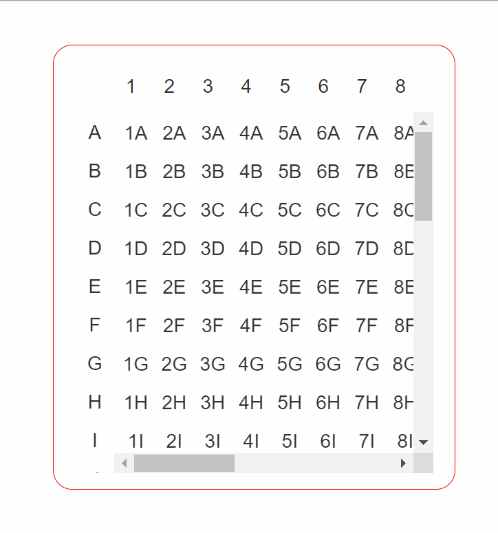

# {{ $frontmatter.title }}

>  :black_nib: 文章摘要
<!-- DESC SEP -->
这篇文章介绍了如何在 JS 或 Vue 中实现表格的列和表头固定功能，适用于不同的开发环境（如原生
JavaScript、Vue、React、小程序等）。文章详细展示了实现这一功能的思路和具体步骤，包括使用 Vue3 和 TypeScript 结合 Less
来完成样式和功能的实现。
<!-- DESC SEP -->

## 写在前面

本文主要介绍关于`JS`或`Vue`中如何进行表头，列固定，可以根据实际应用场景应用于`原生`，`Vue`，`移动端`，`小程序`中

实际效果展示：



## 思路概述

`表头，列头，表格本身，这三个内容被分为了三块元素，将这三个内容进行抽离，并且通过定位和大盒子的包裹进行样式管理。`

【当要进行滚动时，只要对滚动事件进行绑定，让`表头和列头显示对应的内容就完成了滚动的操作`】

下面有`Vue`组件的和`JavaScript`原生的代码，可以直接运行查看逻辑和效果

## 具体实现

整体代码，`可以直接创建组件，将代码复制到组件中使用`，在`App`中引用运行【基于`vue3+ts+less`实现，其他版本会在后面给出修改思路】
`【最下面也提供了原生写法】`

```html
<!--
  ~ Time:2022/8/9 13:06 29
  ~ Name:fixmeTable.vue
  ~ Path:src/components/table
  ~ ProjectName:element-plus
  ~ Author:charlatan
  ~
  ~  Il n'ya qu'un héroïsme au monde :
  ~     c'est de voir le monde tel qu'il est et de l'aimer.
  -->
<script lang="ts" setup>
	import { ref } from 'vue'

	const row = 20
	const column = 30

	let top = ref('0px')
	let left = ref('0px')
	const Scroll = (event: Event) => {
		top.value = -event.target.scrollTop + 'px'
		left.value = -event.target.scrollLeft + 'px'
	}
</script>
<template>
	<h3>
		列头表头固定table
	</h3>
	<hr>
	<!--  表格-->
	<div class="table">
		<!--    表头-->
		<div class="rowHeader">
			<table class="rowHeader-table">
				<tr>
					<td class="td" v-for="(item,index) in row" :key="index">
						{{ item }}
					</td>
				</tr>
			</table>
		</div>
		<!--    列头-->
		<div class="columnHeader">
			<table class="columnHeader-table">
				<tr v-for="(RootItem,index) in column" :key="index">
					<td class="td">
						{{ String.fromCharCode(RootItem + 64) }}
					</td>
				</tr>
			</table>
		</div>
		<!--    表格-->
		<div class="tableBody" @scroll="Scroll($event)">
			<table class="tableBody-table">
				<tr v-for="(RootItem,index) in column" :key="index">
					<td
							class="td" v-for="(item,index) in row" :key="index">
						{{ item + String.fromCharCode(RootItem + 64) }}
					</td>
				</tr>
			</table>
		</div>
	</div>
</template>
<style scoped lang="less">
	.table {
		border: 1px solid red;
		padding: 1rem;
		border-radius: 1rem;
		position: absolute;
		left: 200px;
		top: 100px;
		width: 300px;
		height: 300px;

	/ / 表头 . rowHeader {
		position: relative;
		width: 260px;
		max-width: 300px;
		overflow: hidden;
		left: 30px;

		.rowHeader-table {
			position: relative;
			left: v-bind(left);
			width: fit-content;
		}
	} / / 列头 . columnHeader {
		position: relative;
		max-height: 300px;
		overflow: hidden;
		width: 30px;
		top: 3px;

		.columnHeader-table {
			position: relative;
			top: v-bind(top)
		}
	} / / 表格本体 . tableBody {
		width: 265px;
		height: 300px;
		position: absolute;
		top: 55px;
		left: 50px;
		overflow: auto;
	} / / 表格元素 tr {
		width: fit-content;
		white-space: normal;
		display: flex;

		.td {
			display: block;
			width: 30px;
			height: 30px;
			text-align: center;
			line-height: 30px;
		}
	}
	}
</style>
```

1. `html`部分：主要进行框架的设计，这里表头，列头，表格本体分为三份

   ```html
   <template>
     <h3>
       列头表头固定table
     </h3>
     <hr>
     <!--  表格-->
     <div class="table">
         
       <!--    表头-->
       <div class="rowHeader">
         <table class="rowHeader-table">
           <tr>
             <td class="td" v-for="(item,index) in row" :key="index">
               {{ item }}
             </td>
           </tr>
         </table>
       </div>
         
       <!--    列头-->
       <div class="columnHeader">
         <table class="columnHeader-table">
           <tr v-for="(RootItem,index) in column" :key="index">
             <td class="td">
               {{ String.fromCharCode(RootItem + 64) }}
             </td>
           </tr>
         </table>
       </div>
         
       <!--    表格-->
       <div class="tableBody" @scroll="Scroll($event)">
         <table class="tableBody-table">
           <tr v-for="(RootItem,index) in column" :key="index">
             <td
                 class="td" v-for="(item,index) in row" :key="index">
               {{ item + String.fromCharCode(RootItem + 64) }}
             </td>
           </tr>
         </table>
       </div>
     </div>
   </template>
   ```

内容分为了三部分，这三部分将相互独立，通过样式的调节将三部分内容进行统一的管理。

这里使用的是`table`进行了内容的填充，因为表头和列头是单独的元素，所以可以使用其他内容如`div`等，通过样式上的和交互上的进行协调统一，这里不在赘述

2. 样式上的内容，因为主要是功能，这里样式使用`less`进行简单绘制

   ```css
   <style scoped lang="less">
   .table {
     border: 1px solid red;
     padding: 1rem;
     border-radius: 1rem;
     position: absolute;
     left: 200px;
     top: 100px;
     width: 300px;
     height: 300px;
   
     // 表头
     .rowHeader {
       position: relative;
       width: 260px;
       max-width: 300px;
       overflow: hidden;
       left: 30px;
   
       .rowHeader-table {
         position: relative;
         left: v-bind(left);
         width: fit-content;
       }
     }
   
     // 列头
     .columnHeader {
       position: relative;
       max-height: 300px;
       overflow: hidden;
       width: 30px;
       top: 3px;
   
       .columnHeader-table {
         position: relative;
         top: v-bind(top)
       }
     }
   
     // 表格本体
     .tableBody {
       width: 265px;
       height: 300px;
       position: absolute;
       top: 55px;
       left: 50px;
       overflow: auto;
     }
   
     // 表格元素
     tr {
       width: fit-content;
       white-space: normal;
       display: flex;
   
       .td {
         display: block;
         width: 30px;
         height: 30px;
         text-align: center;
         line-height: 30px;
       }
     }
   }
   </style>
   ```

   内容上和定义的结构进行统一调节，这里需要主要的是：<span style='color:red;font-weight:900;'>
   因为表格的宽度和表头的宽度对应，表格的高度和列头的高度固定，所以建议在定义时考虑好对应的宽高对应关系，方便调节</span>

   在定义好表头和列头时，对与展示的部分通过外部的`div`进行定位的调节进行展示，内部的表格部分通过宽度的固定来达到样式统一，使用相对定位来完成展示内容的切换

   内部使用了Vue3提供的`v-bind`，如果你使用的时vue2或其他内容请更换为内联样式或其他方式

   `v-bind`
   为Vue3中提供，主要是将绑定的内容转换为自定义标签使用，具体介绍可以看我的另一篇文章：[Vue3新属性 — v-bind in css](https://blog.csdn.net/weixin_52235488/article/details/126290046?spm=1001.2014.3001.5502)
   ，里面有用法和原理的详细介绍

3. 逻辑部分：主要为内部的真正的表格绑定了滚动的监听，

   ```html
   <script lang="ts" setup>
   import { ref } from 'vue'
   
   // 定义行和列
   const row = 20
   const column = 30
   
   // 将内容进行响应式定义
   let top = ref('0px')
   let left = ref('0px')
   
   // 绑定对应的监听事件
   const Scroll = (event: Event) => {
     top.value = -event.target.scrollTop + 'px'
     left.value = -event.target.scrollLeft + 'px'
   }
   </script>
   ```

   这里使用的动态数据在`v-bind`中进行，这里直接修改即可

## 其他环境中要修改的内容

这里对常见问题进行解决，如果没有匹配，请评论或找其他方式解决

1. `原生JavaScript中使用`：如果你完全没有使用过`Vue`，上面的代码我也改成了原生的版本，逻辑一样，这里就只放代码不做介绍了
   `直接创建文件复制使用`

   ```html
   <!--
     ~ Time:2022/8/12 9:02 36
     ~ Name:test1.html
     ~ Path:
     ~ ProjectName:element-plus
     ~ Author:charlatan
     ~
     ~  Il n'ya qu'un héroïsme au monde :
     ~     c'est de voir le monde tel qu'il est et de l'aimer.
     -->
   <!DOCTYPE html>
   <html lang="en">
   <head>
   	<meta charset="UTF-8">
   	<meta content="IE=edge" http-equiv="X-UA-Compatible">
   	<meta content="width=device-width, initial-scale=1, maximum-scale=1, user-scalable=no" name="viewport">
   	<title>Title</title>
   	<style>
   		* {
   			margin: 0;
   			padding: 0;
   			list-style: none;
   			font: 500 15px YouYuan;
   			text-decoration: none;
   		}
   
   		li {
   			cursor: pointer;
   			position: relative;
   		}
   
   		/*-------以上为默认设置（The above is the default setting）--------*/
   
   
   		.table {
   			border: 1px solid red;
   			padding: 1rem;
   			border-radius: 1rem;
   			position: absolute;
   			left: 200px;
   			top: 100px;
   			width: 300px;
   			height: 300px;
   		}
   
   		.rowHeader {
   			position: relative;
   			width: 260px;
   			max-width: 300px;
   			overflow: hidden;
   			left: 30px;
   		}
   
   		.rowHeader-table {
   			position: relative;
   			left: 0;
   			width: fit-content;
   		}
   
   		.columnHeader {
   			position: relative;
   			max-height: 270px;
   			overflow: hidden;
   			width: 30px;
   			top: 3px;
   		}
   
   		.columnHeader-table {
   			position: relative;
   			top: 0;
   		}
   
   		.tableBody {
   			width: 265px;
   			height: 270px;
   			position: absolute;
   			top: 55px;
   			left: 50px;
   			overflow: auto;
   		}
   
   		tr {
   			width: fit-content;
   			white-space: normal;
   			display: flex;
   
   
   		}
   
   		.td {
   			display: block;
   			width: 30px;
   			height: 30px;
   			text-align: center;
   			line-height: 30px;
   		}
   	</style>
   </head>
   <body>
   <div class="table">
   	<!--    表头-->
   	<div class="rowHeader">
   		<table class="rowHeader-table">
   			<tr id="rowHeader-table-tr"></tr>
   		</table>
   	</div>
   	<!--    列头-->
   	<div class="columnHeader">
   		<table class="columnHeader-table" id="columnHeader-table-tr"></table>
   	</div>
   	<!--    表格-->
   	<div class="tableBody" id="scroll">
   		<table class="tableBody-table" id="tableBody-table-tr"></table>
   	</div>
   </div>
   </body>
   <script>
   	// 定义行和列
   	const row = 30
   	const column = 30
   
   	// 获取表头
   	let rowHeard = document.getElementById('rowHeader-table-tr')
   	// 创建表头元素
   	for (let i = 0, len = row; i < len; i++) {
   		// 获取元素
   		let td = document.createElement('td')
   		// 添加样式
   		td.classList.add('td')
   		// 添加内容
   		let testNode = document.createTextNode(i)
   		td.appendChild(testNode)
   		// 将表头放置到指定位置
   		rowHeard.appendChild(td)
   	}
   
   	// 创建表头元素
   	let columnHeard = document.getElementById('columnHeader-table-tr')
   	// 创建元素
   	for (let i = 0, len = column; i < len; i++) {
   		let tr = document.createElement('tr')
   		let td = document.createElement('td')
   		td.classList.add('td')
   		td.appendChild(document.createTextNode(String.fromCharCode(i + 64)))
   		tr.appendChild(td)
   		columnHeard.appendChild(tr)
   	}
   
   	// 创建表格元素
   	let table = document.getElementById('tableBody-table-tr')
   	for (let i = 0, len = column; i < len; i++) {
   		let tr = document.createElement('tr')
   		for (let j = 0, len = row; j < len; j++) {
   			let td = document.createElement('td')
   			td.classList.add('td')
   			td.appendChild(document.createTextNode(i + String.fromCharCode(j + 64)))
   			tr.appendChild(td)
   		}
   		table.appendChild(tr)
   	}
   
   	// 获取表头和列头滚动元素
   	let row_heard = document.getElementsByClassName('rowHeader-table')[0]
   	let column_heard = document.getElementsByClassName('columnHeader-table')[0]
   
   	// 绑定滚动时间
   	let scroll = document.getElementById('scroll')
   	scroll.onscroll = function (event) {
   		row_heard.style.left = -event.target.scrollLeft + 'px'
   		column_heard.style.top = -event.target.scrollTop + 'px'
   	}
   </script>
   </html>
   ```

   主要通过的是JS的元素创建然后将元素添加至对应的内容中，然后进行事件的绑定，从而完成整体逻辑

2. `React`和`小程序中`，二者都是可以进行数据的绑定，元素的循环处理更加方法，小程序中没有鼠标，可能要更换为手指滑动操作，对于这个逻辑相同，
   `绑定元素的移动距离`，从而让表头和列头跟随移动从而达到同步的效果和目的


