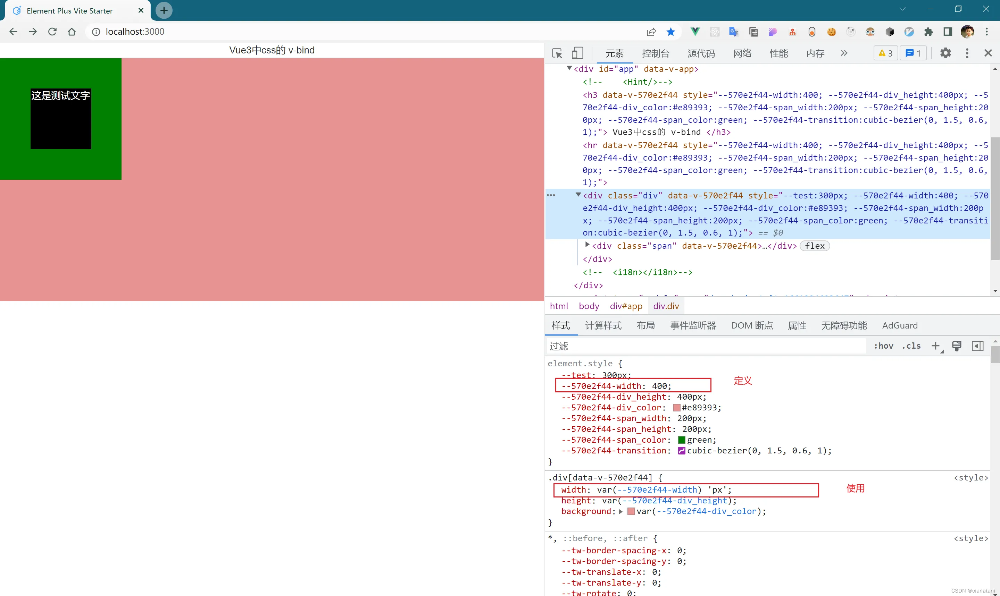

# {{ $frontmatter.title }}

>  :black_nib: 文章摘要

<!-- DESC SEP -->

这篇文章介绍了在 Vue3 中如何使用 v-bind() 来动态绑定 CSS 样式，尤其是在 CSS、LESS 和 SCSS 文件中的应用。

关键内容总结：
背景：文章解释了 Vue3 中 v-bind() 在样式绑定中的新用法，展示了在不同样式表语言（CSS、LESS、SCSS）中的常见应用场景。
实际示例：
CSS：展示了通过 v-bind() 绑定直接使用的值、拼接值、对象调用和组合使用四种方式。
LESS：与 CSS 类似，使用变量和 v-bind() 绑定数据，但在 LESS 中出现了拼接使用的问题。
问题分析：
拼接使用问题：在 LESS 中，某些拼接方式无法正常工作，导致变量无法正确转换为带单位的值，甚至会导致错误。
错误提示：解释了因 LESS 在拼接操作时报错，导致绑定失败的问题。

<!-- DESC SEP -->


# Vue3新属性：CSS 中的 `v-bind()`

## 写在前面 {#write-in-front}

本文主要介绍Vue3中的新增的`v-bind()`的常用使用方式，主要包括在`css`,`less`,`scss`中的使用，可以参考官方文档查看：[Vue3官方文档](https://cn.vuejs.org/api/sfc-css-features.html#v-bind-in-css)，本文将主要通过一个demo中的使用来展示

## 实际使用{#actual-use}

先创建一个通过的页面结构，因为是结构是通用内容，所以这里在直接进行简单的定义

```html
<div class="div">
  <div class="span">
    <div class="span_title">
      这是测试文字
    </div>
  </div>
</div>
```

- 在`css`中：

  在`css`中主要通过直接进行绑定，主要包括几种使用方式（我自己编的名词）：`直接使用`、`拼接使用`、`对象调用`、`组合使用`【这是我想到的几种常见方式，如果有特殊需求，可以评论区沟通】

  在JS中先对需要用的数据进行定义：

  ```js
  
  // 进行拼接调用测试的数据
  let width = 400
  
  // 直接调用的数据
  let div_height = '400px'
  let div_color = '#e89393'
  
  // 对象调用的数据
  let span = {
    width: '200px',
    height: '200px',
    color: 'green',
  }
  
  // 组合调用的数据
  let transition = 'cubic-bezier(0, 1.5, .6, 1)'
  ```

  然后这些数据直接在`css`中进行使用，使用`v-bind()`进行绑定

  ```css
  <style scoped lang="css">
  .div {
    /* 拼接使用 */
    width: v-bind(width + 'px');
    /* 直接使用 */
    height: v-bind(div_height);
    background: v-bind(div_color);
  }
  
  .span {
    /* 对象调用 */
    width: v-bind('span.width');
    height: v-bind('span.height');
    background: v-bind('span.color');
    display: flex;
    justify-content: center;
    align-items: center;
  }
  
  .span_title {
    width: 100px;
    height: 100px;
    background: #000;
    color: white;
    /* 组合使用 */
    transition: all .9s v-bind(transition);
  }
  
  .span:hover .span_title {
    border-radius: 50%;
    background: #a5f5b8;
    color: #ff0000;
  }
  </style>
  ```

  在对应的四个方式的调用中：

  `直接使用`：完全没有问题

  `拼接使用`：这个在`css`中没有问题，不过在`scss`中会出现错误，这个在下面的`scss`中会有详细介绍

  `对象调用`：对象的调用和直接使用类似，不过不同的是，需要使用引号的包裹才能正常使用，如果直接书写会报错

  `组合使用`：完全没问题

- 在`less`中：

  使用的数据同样是上面给出的数据，这里直接改样式的内容了

  ```css
  <style scoped lang="less">
  // 使用变量承接
  @height: v-bind(div_height);
  
  .div {
    width: 400px;
    /* 直接使用 */
    height: @height;
    background: v-bind(div_color);
  
    .span {
      @width: v-bind('span.width');
  
      /* 对象调用 */
      width: @width;
      height: v-bind('span.height');
      background: v-bind('span.color');
      display: flex;
      justify-content: center;
      align-items: center;
  
      .span_title {
        @transition: v-bind(transition);
        width: 100px;
        height: 100px;
        background: #000;
        color: white;
        /* 组合使用 */
        transition: all .9s @transition;
      }
  
      &:hover .span_title {
        border-radius: 50%;
        background: #a5f5b8;
        color: #ff0000;
      }
    }
  }
  </style>
  ```

  `直接使用`：没有问题

  `拼接使用`：**存在问题**，在下面尝试进行了解决

  `对象调用`：没问题

  `组合使用`：没问题

  <h3>问题：</h3>

  > 在拼接使用有几种方式：
  >
  > ```js
  > // 定义使用的数据
  > let width = 400
  > ```
  >
  > ```css
  > // 直接拼接
  > @width: v-bind( width + 'px');
  > width: @width;
  > 
  > // 拿到内容后拼接
  > @width: v-bind(width) + 'px';
  > width: @width;
  > 
  > // 使用时拼接
  > @width: v-bind(width);
  > width: @width + 'px';
  > 
  > ```
  >
  > 常用的拼接方法一般为这几种（如果有欠缺还请补充），这几种方式都进行了尝试，其中第二种第三种会没有效果，第一种会直接报错

  

  <h3>问题分析（尝试解决）：【这部分会很长，如果不想看，可以直接跳到解决方法】</h3>

  首先是第一种，如果使用的话会直接报错，报错内容为：

 

  因为`less`的直接报错，导致定义的变量压根就没有被编译出来，从而报错

  第二种和第三种错误一样：




  在这种使用方式中，变量可以正确承接，但是不能完成拼接的操作，导致只有变量而没有单位，并且可以看出最终都被翻译为`var(--变量名)`来执行，所以顺便也对`var()`进行了拼接测试


  这里进行调用内容的定义，并且模仿编译后的内容，进行使用，在这种情况下尝试使用拼接

  > 尝试的拼接方式：
  >
  > `直接拼接`：
  >
  > ```css
  > :root{
  >   --test:400 + 'px';
  > }
  > /* 使用 */
  > width: var(--test);
  > ```
  >
  > `接受变量后拼接`：
  >
  > ```css
  > :root{
  >   --test:400 + 'px';
  > }
  > /* 使用 */
  > width: var(--test+ 'px');
  > ```
  >
  > `继承后拼接`：
  >
  > ```css
  > :root{
  >   --test:400 + 'px';
  > }
  > /* 使用 */
  > width: var(--test) + 'px';
  > ```

  结果也非常让不出意外的都不行，并且在第二种方式也是直接报错的，在寻找问题的过程中，发现了更加`amazing`的事情：


  这个变量压根就没定义，或者说没被识别到，所以重新模仿`Vue`直接定义行内样式，并且使用拼接尝试：


  这种直接的拼接方式直接将所有内容都进行了拼接，再换一种思路：使用`V-bind`这个V-bind指的是数据的而不是样式：


  这次问题得到了解决，并且样式数据也是响应式的单个数据，并且也是在`less`中正确使用，应该也算解决问题吧

  <h3>解决方式（思路）：</h3>

  将变量的内容在`行内样式`使用拼接的方式进行定义，然后在定义的`less或scss`中进行使用，因为定义的样式是行内样式，所以优先级和变量出现的位置，都是在使用之前，所以可以正常使用

  <h3>完整代码：</h3>

  > 使用数据的定义：
  >
  > ```js
  > // 大部分数据和预先提供的数据一样（这里只写了新增数据）
  > let test = 400
  > ```
  >
  > 页面结构：
  >
  > ```html
  > <!--	改变的内容为下面这行（其他内容和原来内容保持一致）-->
  > <!--	【在这里对要使用的数据进行单位的绑定】-->
  > <div class="div" :style="{'--test' :test + 'px'}">
  >  <div class="span">
  >    <div class="span_title">
  >      这是测试文字
  >    </div>
  >  </div>
  > </div>
  > ```
  >
  > 样式的使用：
  >
  > ```css
  > <style scoped lang="less">
  > // 承接使用
  > @width: var(--test);
  > 
  > .div {
  > /* 使用 */
  > width: @width;
  > /* 或者直接使用 */
  > width: var(--test);
  > height: 400px;
  > background: red;
  > }
  > </style>
  > ```
  >

  

  在`css`的测试中几种方式也都能完美运行，并且在`less`的特有的数据绑定中也都没有问题，对于`拼接使用`是可以正常使用的。

  我用的工具是`webstorm`less也是唯一一个没有报错的提示的（工具内的报错提示，可能不认识新内容把）

- 在`scss`中：

  ```css
  <style scoped lang="scss">
  // 使用变量承接
  $width: v-bind(width + 'px');
  $height: v-bind(div_height);
  
  .div {
    /* 拼接使用 */
    width: $width;
    /* 直接使用 */
    height: $height;
    background: v-bind(div_color);
  
    .span {
      $width: v-bind('span.width');
  
      /* 对象调用 */
      width: $width;
      height: v-bind('span.height');
      background: v-bind('span.color');
      display: flex;
      justify-content: center;
      align-items: center;
  
      .span_title {
        $transition: v-bind(transition);
        width: 100px;
        height: 100px;
        background: #000;
        color: white;
        /* 组合使用 */
        transition: all .9s $transition;
      }
  
      &:hover .span_title {
        border-radius: 50%;
        background: #a5f5b8;
        color: #ff0000;
      }
    }
  }
  </style>
  ```

  `scss`相对`less`一些方法更加灵活，在`v-bind()`的使用中，拼接使用会出现错误，这个暂时按下不表，在原理中会详细阐述

- 执行原理：

  `v-bind() in css`并没有进行劫持或者其他操作，他主要完成的任务是将`v-bind()`中的内容通过自定义属性的方式进行了重新定义，在编译后代码中可以看到

  


  所有的数据直接在自定义属性中进行，并且直接对应引用，自定义属性的内容的改变影响视图的效果，从而达到数据影响视图的效果，这个在使用中`less`,`css`中完全没有问题

  但是，在`scss`中，因为编译之后`名字无法进行匹配`从而造成样式的丢失

  


  可以看到，使用的名字和编译的名字并不匹配，从而出错，这个使用时需要注意


