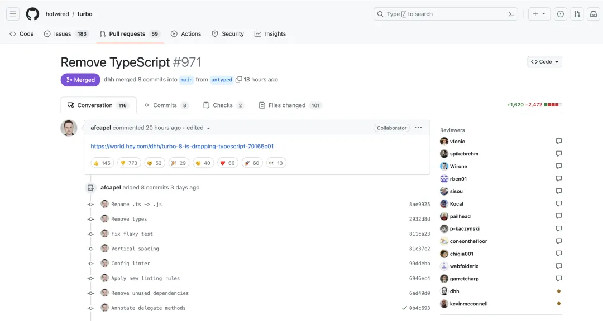

# {{ $frontmatter.title }}

>  :black_nib: 文章摘要

<!-- DESC SEP -->

文章讨论了关于是否放弃 TypeScript 的问题，尤其是在一些大牛和社区项目的选择上。重点聚焦于两篇文章的观点：

Turbo 8 放弃 TypeScript：作者认为 TypeScript 的类型检查反而增加了开发中的负担，并且声明类型复杂化代码，减少了开发效率。这个观点在 Reddit 和知乎引发了激烈讨论，部分评论指出 Turbo 8 并不具备广泛影响力，且作者习惯发表反向意见。

TypeScript 的额外成本：第二篇文章提到，在某些场景下，TypeScript 的类型体操带来不必要的复杂度，尤其是对于小型项目，编写精确的类型定义可能比核心逻辑代码更为冗长。然而，TypeScript 相比于 JavaScript 在维护性和可扩展性上具有优势，尤其是对于框架和类库的开发者而言，尽管带来一些额外的维护成本。

总体来看，放弃 TypeScript 的选择多见于小型或开源项目的维护者，而对于大多数开发者来说，TypeScript 提供的类型系统和可维护性仍然是更受欢迎的选择。

<!-- DESC SEP -->

### TypeScript 应该放弃吗

--------

抛出这个问题主要基于22年和23年发生的一些事件：

并且Svelte 不是第一个放弃 TypeScript 的前端框架。早在 2020 年，Deno 就迁移了一部分內部 TypeScript 代码到 JavaScript，以减少构建时间。

并且这些大牛放弃 TypeScript 似乎还加快了工作进度，但这个选择是否应该被普通开发者所选择？

搜了很多文章，但是大部分都在将一些很正确的废话，目前来看只有下面两篇有参考价值。

##### 第一篇：[Turbo 8 正在放弃 TypeScript (hey.com)](https://world.hey.com/dhh/turbo-8-is-dropping-typescript-70165c01)

>
> 这是原文，正是这篇文章，引来了众多讨论

文章的主要观点如下：

> TypeScript 只是妨碍了我。不仅因为它需要显式的编译步骤，还因为它用类型体操污染了代码

—— 多余类型判断只会降低效率

文章没有多长，几乎没有太多参考价值，但毕竟是原文，还是搬过来比较好。

并且对于这篇文章，Reddit的评论区也是活力十足

并且在知乎对于这个问题的评价更加激进：

以下是文字版本：

> 前端届盛产大牛，整点别人看不懂的代码，硬说函数式然后猛劲宣传就能当大牛。
>
> 搞计算机其实有一点不好，就是你以为有些应该不在世的大师他都活着呢。
>
> 算法分析之父高德纳还在呢。
>
> WindowsNT 内核之父 David Cuttler 也还在呢。
>
> Linux 内核之父 Linus 还到处喷人呢。
>
> GUI 和面向对象之父 Allen Kay 也还在呢。
>
> Pascal 总架构师，Delphi 和 C# 之父，编程语言届的传奇 **Anders Hejlsberg** 也还在努力工作呢。
>
> 我不明白某些在社区当网红的不入流货色是怎么敢被封为大牛还大放厥词的。
>
> 对了，TypeScript 就是 Anders 搞的。

无论是知乎还是Reddit的讨论都是相对激进，并拳拳到肉那种，只顾着输出情绪了。不过总结起来大致为以下两个观点：

1. Turbo 8 并不是什么知名项目，没人在意他是否放弃 TypeScript
2. Turbo 8 的作者（也是文章作者），经常写类似的文章来唱反调
3. 文章除了说明了类型让他更加麻烦了，并且有提出其他有力依据，所以被Reddit评论区狂怼
4. 这个大牛是虚假宣传的，为了博眼球臆造出来的，而那些真正的大牛创造了TypeScript

当然**无意义的情绪输出不能解决任何问题**，所以也有下面这个文章通过多个方面来讨论为什么那些社区项目会放弃TypeScript

##### 第二篇：[“根本不需要 TypeScript，JS + JSDoc 够了”，大佬说我想多了](https://my.oschina.net/u/6852546/blog/10114672)

文章的主要观点如下：

> 某些场景下，写 TypeScript 会带来一些额外成本。一些开源库的源码，核心逻辑可能就几十行，但为了实现准确的类型提示，写出来的类型体操反而远远多于核心源码，孰是孰非对于不同的开发者有不同的准绳，需要找到其中的平衡点。

—— 对于特定场景，TypeScript 确实更麻烦了

> 使用了 TypeScript 的项目改回使用 JavaScript 是很少见的，更多的项目是从 JavaScript 升级到 TypeScript。TypeScript 完善了 JavaScript 的类型系统，使得代码的可维护性更高了.

—— 相对来说，TypeScript 相对于 JavaScript 是更加受欢迎的，并且被更多项目所接受

> **框架和类库的开发者，往往需要考虑到很多 edge case**，在这种情况下，编写完善的类型是一件很费心力的事，代码量会多了不少，从而会导致维护成本的增加。

—— 放弃 TypeScript 的更多是那些公共仓库的维护者，而他们需要考虑所有有可能出现的情况，会有非常多的边缘判断来减少异常，这也造成了如果使用 TypeScript反而会更麻烦

> TypeScript 的成功无需质疑，已经有无数的项目证明了它的成功。开发者并没有 “嫌弃” TypeScript，只是认为并不是所有项目都适合使用 TypeScript。

> **有人认为，** **TypeScript** **的出现是因为一般人驾驭不了** **JavaScript** **，有人则觉得 “水平越差的人越喜欢自由”，你怎么看？这两个语言的选择跟程序员的水平有关吗？**
>
> - 平时可没少见有同学吐槽，**好好的 TypeScript 项目，被人提交了一堆 Any**。也见过很多吐槽接手了一个 TypeScript 仓库，要硬着头皮看一大堆类型定义，搞清楚这些奇奇怪怪的类型是如何工作的。我觉得语言的选择主要看团队的工程化和规范化程度，过犹不及。如果一个 TypeScript 类库写了一大堆类型，但却连一个单测都没有，那我觉得它是不合格的。
> - JavaScript 和 TypeScript 不能用来衡量程序员的水平。对于简单的项目或者个人项目而言，JavaScript 可能更加轻量和灵活，但对于需要大团队协作，复杂的项目而言，TypeScript 的类型系统就可以带来更好的代码维护性和可靠性了。

该文章相对来说理性了很多，通过一些采访来尽量还原更加客观的事实，并且对于 TypeScript 的选择相对来说没有那么难决断，那些仓库的作者因为繁琐的 **edge case** 放弃了 TS，但这并不代表他没有一点自己的用武之地，在常规的项目中，尤其是大型的多人合作项目中，TS也会是优先的选择。

并且无论是TS还是JS都能做出很好的产品，二者没有高低贵贱之分，如果一个TS项目写满了 `Any` 那不如直接切换为 JS 反而在某种程度还更能节约代码量了

