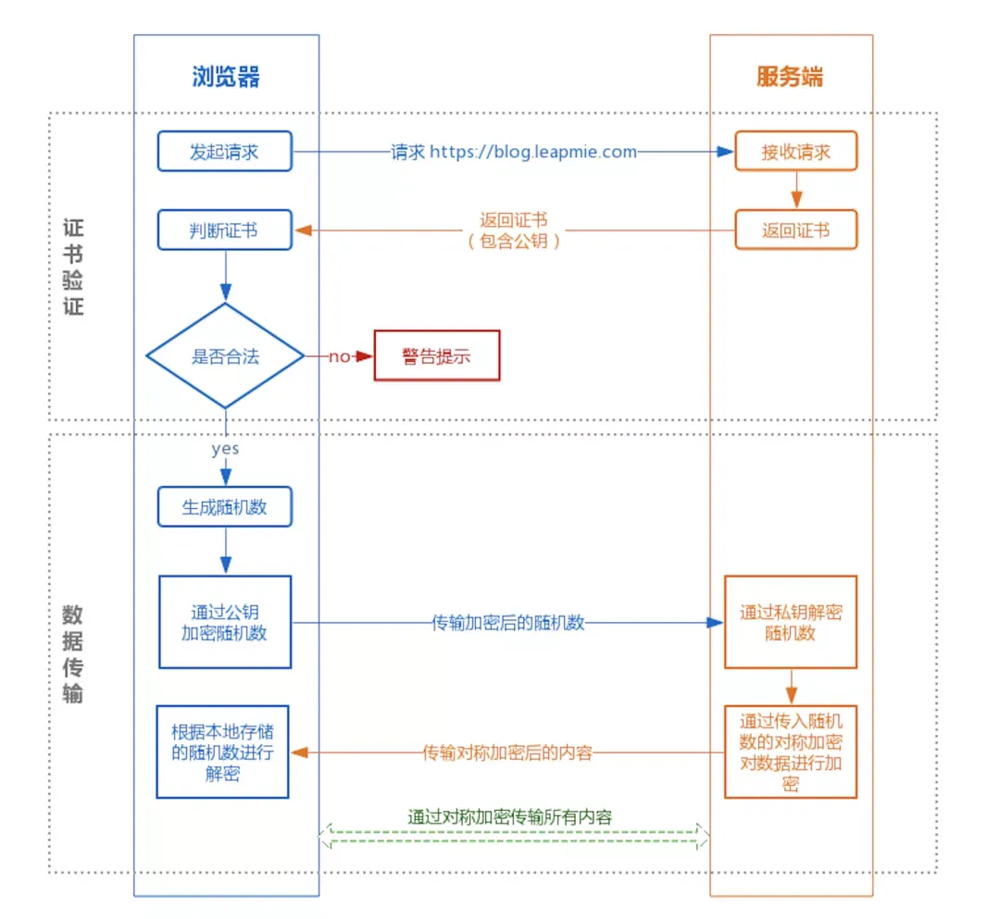

# {{ $frontmatter.title }}

>  :black_nib: 文章摘要
<!-- DESC SEP -->

这篇文章介绍了如何安全地存储用户数据，包括用户名、密码哈希、邮箱等，强调使用 bcrypt 加密密码和唯一盐来提升安全性。它还详细解释了 HTTPS 如何通过加密、身份验证和数据完整性保护来确保通信安全，并探讨了前端加密与 HTTPS 的配合使用。此外，文章还讨论了如何管理 SSL/TLS 证书、Token 存储和安全性防护策略，如防止 XSS 和 CSRF 攻击。

<!-- DESC SEP -->

## 用户信息应该保存什么数据

- `username`：唯一的用户名。
- `password_hash`：使用加密算法（如 bcrypt）对密码加密后的结果。
- `email`：用户的邮箱，作为额外的联系方式和用户名的验证。
- `created_at` 和 `updated_at`：记录用户的创建时间和最后一次更新时间。

其他：

- **Email**：用于账户验证和找回密码。
- **创建时间（created_at）**：记录账户创建时间。
- **更新时间（updated_at）**：记录账户信息的最后更新时间。
- **用户角色（role）**：标识用户身份，如普通用户、管理员等，用于权限管理。
- **状态（status）**：标识用户状态，如活跃、锁定、禁用等，用于账户管理。
- **最后登录时间（last_login_at）**：记录用户最后一次登录时间。
- **安全问题及答案**（可选）：用于找回密码。
- **登录失败次数（login_attempts）**：记录用户登录失败次数，用于防止暴力破解。
- 注册时间
- 注册IP
- 上次登录时间
- 登录地址
- 用户权限
- 手机号

## 密码如何保存

`bcrypt`是由`Niels Provos`和`David Mazières`设计的密码哈希函数，他是基于Blowfish密码而来的，并于1999年在USENIX上提出。

除了加盐来抵御`rainbow table` 攻击之外，`bcrypt`
的一个非常重要的特征就是自适应性，可以保证加密的速度在一个特定的范围内，即使计算机的运算能力非常高，可以通过增加迭代次数的方式，使得加密速度变慢，从而可以抵御暴力搜索攻击。

`bcrypt`函数是`OpenBSD`和其他系统包括一些Linux发行版（如SUSE Linux）的默认密码哈希算法。

**推荐使用**每个用户都拥有一个独立的、唯一的盐。这种方式可以显著提高安全性，因为即使两个用户使用相同的密码，由于盐不同，生成的哈希值也会完全不同。

#### 生成盐

- **随机生成**：使用密码学安全的随机数生成器生成盐，例如使用 `java.security.SecureRandom` 生成盐。
- **长度建议**：一般来说，盐的长度至少为 16 字节，以增加其随机性和安全性。

#### **盐的存储**

- **单独存储**：将每个用户的盐单独存储在数据库中，与用户的其他信息（例如 `user_id`、`hashed_password`）一起存储。

#### **处理已有用户的密码**

如果需要为已有用户的密码增加盐，可以采取以下步骤：

1. **逐步迁移**：在用户下次登录时，提示用户更改密码并生成新的哈希和盐（用户更改密码时应该重新生成**盐**）。
2. **批量更新**：将所有用户密码通过一次性脚本批量更新为新的加盐哈希值。
3. **新老兼容**：在验证用户密码时，首先尝试使用老的哈希方式，如果失败则使用新的加盐哈希方式。

#### **注意事项**

- **使用安全的随机数生成器**：避免使用 `Math.random()` 这样的伪随机数生成器，而是使用 `SecureRandom` 等密码学安全的随机数生成器。
- **避免重复使用盐**：每个用户的盐都应该是唯一的，避免不同用户之间的盐重复使用。
- **保护盐的安全**：尽管盐本身不需要加密，但它仍然是安全链条中的一部分，应妥善保护，避免泄露。

## HTTPS 如何保证数据安全

**HTTPS**（Hypertext Transfer Protocol Secure）是一种用于在客户端和服务器之间安全传输数据的协议。

> http是无状态的超文本传输协议，连接简单，信息是明文传输，端口为80。
> https协议是由http+ssl协议构建的可进行加密传输、身份认证的具有安全性网络协议,端口是443。
>
> https通过使用 SSL，HTTPS 具有了加密（防窃听）、认证（防伪装）和完整性保护（防篡改）。

**加密方式**：

> HTTPS 采用混合的加密机制，使用非对称密钥加密用于传输对称密钥来保证传输过程的安全性，之后使用对称密钥加密进行通信来保证信息传输过程的效率。非对称加密只作用在证书验证阶段。

**HTTPS的缺点**:

> 1）因为需要进行加密解密等过程，因此速度会更慢；
> 2）需要支付证书授权的高额费用。


**交互过程**：

客户端发起 HTTPS
请求，服务端返回证书，客户端对证书进行验证，验证通过后本地生成用于改造对称加密算法的随机数，通过证书中的公钥对随机数进行加密传输到服务端，服务端接收后通过私钥解密得到随机数，之后的数据交互通过对称加密算法进行加解密。

1. 客户端向服务器发起HTTPS请求，连接到服务器的443端口。
2. 服务器端有一个密钥对，即公钥和私钥，是用来进行非对称加密使用的，服务器端保存着私钥，不能将其泄露，公钥可以发送给任何人。
3. 服务器将自己的公钥发送给客户端。
4. 客户端收到服务器端的公钥之后，会对公钥进行检查，验证其合法性，如果发现发现公钥有问题，那么HTTPS传输就无法继续。严格的说，这里应该是验证
5. 务器发送的数字证书的合法性，关于客户端如何验证数字证书的合法性，下文会进行说明。如果公钥合格，那么客户端会生成一个随机值，这个随机值就是用于进行对称加密的密钥，我们将该密钥称之为client
   key，即客户端密钥，这样在概念上和服务器端的密钥容易进行区分。然后用服务器的公钥对客户端密钥进行非对称加密，这样客户端密钥就变成密文了，至此，HTTPS中的第一次HTTP请求结束。
6. 客户端会发起HTTPS中的第二个HTTP请求，将加密之后的客户端密钥发送给服务器。
7. 服务器接收到客户端发来的密文之后，会用自己的私钥对其进行非对称解密，解密之后的明文就是客户端密钥，然后用客户端密钥对数据进行对称加密，这样数据就变成了密文。
8. 然后服务器将加密后的密文发送给客户端。
9. 客户端收到服务器发送来的密文，用客户端密钥对其进行对称解密，得到服务器发送的数据。这样HTTPS中的第二个HTTP请求结束，整个HTTPS传输完成。



它通过以下方式保证数据的安全性：

**数据加密**

- **加密数据传输**：HTTPS 使用 TLS（Transport Layer Security）协议对数据进行加密，确保传输中的数据无法被窃听或篡改。
- **对称加密**：在 TLS 连接建立后，双方使用对称加密算法（如 AES）加密传输的数据，速度快且效率高。

**身份验证**

- **服务器认证**：通过 SSL/TLS 证书，客户端可以验证服务器的身份，防止中间人攻击。
- **防止钓鱼网站**：用户可以确认访问的服务器是否为合法的服务器，避免被引导至钓鱼网站。

**数据完整性**

- **防止数据篡改**：通过哈希函数和 MAC（Message Authentication Code），确保数据在传输过程中未被篡改。

## 是否可以不依赖 HTTPS，仅依赖前端加密来保证安全性？

#### 安全性的局限

即使前端使用了加密技术，如果没有 HTTPS 作为底层保护，仍然存在以下安全隐患：

- **中间人攻击（MITM）**：攻击者可以拦截和修改前端与后端之间的通信内容，即使加密了密码，也可能无法防止攻击者篡改其他请求参数或注入恶意代码。
- **公钥篡改**：如果攻击者能够篡改你的网站或应用中的公钥，他们可以用自己的公钥替换你网站的公钥，从而获得解密私钥。
- **数据完整性**：没有 HTTPS 的保护，传输的数据可能被篡改，而不仅仅是密码，还包括其他敏感信息。

#### 攻击者可以如何篡改公钥？

公钥篡改主要涉及以下几种方式：

**中间人攻击（MITM）**

- **工作原理**：攻击者拦截用户和服务器之间的通信，并在其间插入自己的公钥。
- **实现方式**：攻击者可以通过DNS劫持、网络劫持或伪造Wi-Fi热点等方式拦截流量并插入恶意公钥。

**服务器端攻击**

- **访问服务器**：攻击者通过漏洞或其他方式入侵你的服务器，替换服务器上的公钥。
- **后果**：用户使用篡改后的公钥进行加密，攻击者可以用对应的私钥解密。

**前端代码篡改**

- **篡改代码**：攻击者可以通过入侵 CDN、服务器或开发者的本地机器，修改前端代码，替换其中的公钥。
- **发布渠道**：通过不安全的渠道发布应用，导致篡改的公钥传播给用户。

#### HTTPS 与前端加密的协作

为了最大限度地确保数据安全，推荐将前端加密与 HTTPS 结合使用：

- **HTTPS 传输**：通过 HTTPS 确保整个传输通道的安全性。
- **前端加密**：在前端对敏感数据（如密码）进行加密，作为额外的安全保障。
- **多层保护**：即使 HTTPS 被攻破，前端加密也能提供另一层保护。

## 前端如何防止公钥被篡改？

**使用 HTTPS 和证书验证**

- **确保公钥安全传输**：通过 HTTPS 传输公钥，防止中间人攻击。
- **使用可信证书**：通过可信的 CA 签发的证书确保公钥的合法性。

**内容安全策略（CSP）**

> CSP 的实质就是白名单制度，开发者明确告诉客户端，哪些外部资源可以加载和执行，等同于提供白名单。它的实现和执行全部由浏览器完成，开发者只需提供配置。

- **定义内容来源**：使用 CSP 限制加载的资源，防止加载恶意的脚本和公钥。

- **用途**
  ：用于检测并削弱某些特定类型的攻击，包括跨站脚本（[XSS](https://developer.mozilla.org/zh-CN/docs/Glossary/Cross-site_scripting)
  ）和数据注入攻击等。

- **示例配置**：

  ```javascript
  Content-Security-Policy: default-src 'self'; script-src 'self' https://trusted.cdn.com
  ```

**前端代码完整性校验**

- **Subresource Integrity (SRI)**：使用 SRI 确保加载的前端资源（如 JS 脚本）未被篡改。

  ```html
  <script src="https://trusted.cdn.com/script.js" integrity="sha384-..."></script>
  ```

- **代码签名**：对前端代码进行签名，用户可以验证下载的代码是否被篡改。

**前端代码加密**

- **代码混淆**：使用代码混淆工具增加代码的复杂性，防止反编译和分析。比如，Webpack、UglifyJS 等工具可以对 JavaScript 代码进行混淆。
- **加密重要数据**：将敏感数据和密钥加密存储在前端，并通过运行时解密使用。

**安全加载资源**

- **内容安全策略（CSP）**：使用 CSP 限制加载的脚本和资源来源，防止恶意代码篡改。
- **子资源完整性（SRI）**：通过 SRI 验证加载资源的完整性，确保资源未被篡改。

## 前端应该如何存储公钥？

**存储在代码中**

- **嵌入代码**：将公钥硬编码在前端代码中，这是最常见的做法，但容易被静态分析工具提取。

- **示例**：

  ```javascript
  const publicKey = `-----BEGIN PUBLIC KEY-----
  ...
  -----END PUBLIC KEY-----`;
  ```

**动态获取**

- **通过 HTTPS 获取**：从服务器动态获取公钥，并通过 HTTPS 确保传输安全。
- **防止缓存攻击**：设置合适的缓存策略，防止恶意缓存替换公钥。

**加密存储**

- **加密存储**：将公钥加密存储在前端，启动时解密使用。
- **密钥管理**：需要安全管理用于解密公钥的密钥。

**使用 CDN**：将公钥存储在可信的 CDN 上，并通过 HTTPS 获取，确保前端的公钥安全更新。

## 如何保证后端私钥的安全存储？

**私钥存储位置**

- **硬编码的风险**：将密钥直接硬编码在代码中非常危险，攻击者可以通过反编译或分析代码轻松获取密钥。
- **硬件安全模块（HSM）**：HSM 是专门设计用于存储密钥的设备，具有极高的安全性和防篡改特性。它能生成和存储密钥，并执行加密运算，极大减少私钥泄露的风险。
- **云密钥管理服务**：如 AWS KMS、Azure Key Vault、Google Cloud KMS 等，提供安全的密钥管理和加密服务，可以将密钥存储在云端，避免密钥管理的复杂性和潜在的安全风险。
- **安全文件存储**：如果无法使用 HSM 或云服务，可以将私钥存储在服务器的安全文件系统中，严格控制访问权限（如仅允许特定用户和进程访问）。
- **环境变量**：
    - **安全存储**：将密钥或密钥文件路径存储在环境变量中，避免硬编码在代码中。
    - **安全读取**：通过环境变量读取密钥，并确保环境变量的访问权限受控。
- **加密密钥管理库**：
    - **专用库**：如 JCE（Java Cryptography Extension）、OpenSSL、bcrypt 等，可以提供密钥加密、解密和存储功能。
    - **加密和解密流程**：利用这些库，密钥可以在需要时解密使用，避免直接暴露在代码中。
- **密钥保护库**：
    - **使用库和框架**：使用像 HashiCorp Vault、Azure Key Vault 等专用库和框架来管理和保护密钥。
    - **密钥存储服务**：利用操作系统或平台提供的密钥存储服务，如 macOS 的钥匙串、Windows 的 DPAPI（数据保护 API）等。

**安全更新和备份**

- **定期更新**：定期更换私钥，并确保旧密钥不再使用，减少长期使用同一密钥的风险。
- **安全备份**：将私钥备份在安全的地方，并确保备份数据的加密和访问控制。

## 如何保证公钥和私钥的安全更新？

**使用可信工具**:使用 OpenSSL、Java KeyTool 等工具生成密钥，确保密钥生成过程的安全性

**密钥替换周期**

- **定期轮换**：根据安全需求和行业标准，定期更换密钥。通常建议每 1-2 年更换一次，但对于高风险的应用，可以更频繁地更换。
- **紧急更换**：在检测到潜在的安全威胁或密钥泄露时，立即更换密钥。

**自动化密钥管理**

- **自动化工具**：使用工具和脚本自动化密钥生成、分发和更新流程，减少人为错误。
- **密钥版本管理**：实现密钥版本控制，每次更新都生成一个新版本，逐步替换旧版本，并确保新旧密钥的兼容性。

**密钥更新通知**

- **前端同步更新**：后端密钥更新后，通过安全的通知机制将新公钥分发到前端，前端在下一次更新时使用新公钥。
- **密钥有效期**：使用密钥的有效期管理机制，确保在旧密钥失效前及时更换新密钥。

## 登录标志（Token）

#### 推荐的存储方式

1. **使用 Cookie 存储 Token**

    - **HttpOnly 和 Secure**：设置 HttpOnly 属性，防止 JavaScript 读取。设置 Secure 属性，仅允许在 HTTPS 连接中传输。
    - **SameSite 属性**：设置为 `Strict` 或 `Lax`，防止 CSRF 攻击。

   > **什么是 CSRF 攻击**？
   >
   > 这一天，小明同学百无聊赖地刷着Gmail邮件。大部分都是没营养的通知、验证码、聊天记录之类。但有一封邮件引起了小明的注意：
   >
   > > 甩卖比特币，一个只要998！！
   >
   > 聪明的小明当然知道这种肯定是骗子，但还是抱着好奇的态度点了进去（请勿模仿）。果然，这只是一个什么都没有的空白页面，小明失望的关闭了页面。一切似乎什么都没有发生……
   >
   >
   在这平静的外表之下，黑客的攻击已然得手。小明的Gmail中，被偷偷设置了一个过滤规则，这个规则使得所有的邮件都会被自动转发到hacker@hackermail.com。小明还在继续刷着邮件，殊不知他的邮件正在一封封地，如脱缰的野马一般地，持续不断地向着黑客的邮箱转发而去。
   >
   > 不久之后的一天，小明发现自己的域名已经被转让了。懵懂的小明以为是域名到期自己忘了续费，直到有一天，对方开出了 $650
   的赎回价码，小明才开始觉得不太对劲。
   >
   > 小明仔细查了下域名的转让，对方是拥有自己的验证码的，而域名的验证码只存在于自己的邮箱里面。小明回想起那天奇怪的链接，打开后重新查看了“空白页”的源码：
   >
   > ```javascript
   > <form method="POST" action="https://mail.google.com/mail/h/ewt1jmuj4ddv/?v=prf" enctype="multipart/form-data"> 
   >     <input type="hidden" name="cf2_emc" value="true"/> 
   >     <input type="hidden" name="cf2_email" value="hacker@hakermail.com"/> 
   >     .....
   >     <input type="hidden" name="irf" value="on"/> 
   >     <input type="hidden" name="nvp_bu_cftb" value="Create Filter"/> 
   > </form> 
   > <script> 
   >     document.forms[0].submit();
   > </script>
   > ```
   >
   > > 这个页面只要打开，就会向Gmail发送一个post请求。请求中，执行了“Create Filter”命令，将所有的邮件，转发到“hacker@hackermail.com”。
   > >
   > > 小明由于刚刚就登陆了Gmail，所以这个请求发送时，携带着小明的登录凭证（Cookie），Gmail的后台接收到请求，验证了确实有小明的登录凭证，于是成功给小明配置了过滤器。
   > >
   > > 黑客可以查看小明的所有邮件，包括邮件里的域名验证码等隐私信息。拿到验证码之后，黑客就可以要求域名服务商把域名重置给自己。
   >
   > 小明很快打开Gmail，找到了那条过滤器，将其删除。然而，已经泄露的邮件，已经被转让的域名，再也无法挽回了……
   >
   > 以上就是小明的悲惨遭遇。而“点开一个黑客的链接，所有邮件都被窃取”这种事情并不是杜撰的，此事件原型是2007年Gmail的CSRF漏洞：
   >
   > [https://www.davidairey.com/google-Gmail-security-hijack/](https://www.davidairey.com/google-gmail-security-hijack/)
   >
   > 当然，目前此漏洞已被Gmail修复

2. **结合使用 LocalStorage 和内存**

    - **LocalStorage**：用于存储 Token 的加密副本，用于持久化和恢复。
    - **内存**：在运行时将 Token 加载到内存中，减少对 LocalStorage 的访问。

#### Token 存储时机

1. **登录成功后**：
    - 在用户成功登录后，从服务器接收到 Token，并在前端存储。
2. **Token 刷新时**：
    - 在 Token 即将过期时，通过刷新 Token API 获取新的 Token，并更新存储。

#### 携带 Token 的时机

1. **自动登录**：
    - 在页面加载时检查 Token 是否存在并有效。
    - 如果有效，自动发送 Token 进行身份验证。
2. **每次 API 请求**：
    - 每次向受保护的 API 发送请求时，携带 Token 进行身份验证。
3. **页面重载**：
    - 当页面重载或导航时，从存储中读取 Token 并加载到内存中。

#### Token 的携带方式

1. **HTTP Header**

    - 最常用的方法是在请求头中携带 Token，通常使用 `Authorization` 头。

    - 示例代码：

      ```javascript
      javascript复制代码// 使用 Fetch API 发送请求
      fetch('https://api.example.com/data', {
          method: 'GET',
          headers: {
              'Authorization': 'Bearer ' + token
          }
      }).then(response => response.json())
        .then(data => console.log(data));
      ```

2. **URL 参数**

    - 一般不推荐，因为 URL 参数容易泄露和被篡改。

3. **Cookie**

    - 在请求时，浏览器会自动携带符合条件的 Cookie。
    - 需要确保 Cookie 设置了 Secure、HttpOnly 和 SameSite 属性。

### 安全性考虑

#### 防范 XSS 攻击

- **内容安全策略（CSP）**：通过 CSP 限制加载的脚本和资源来源，减少 XSS 攻击的风险。
- **输入验证**：对所有用户输入进行严格的验证和过滤，防止恶意代码注入。

#### 防范 CSRF 攻击

- **SameSite Cookie 属性**：设置为 `Strict` 或 `Lax`，限制跨站请求。
- **CSRF Token**：为每个请求生成一个唯一的 CSRF Token，并验证 Token 的有效性。

#### 防止 Token 泄露

- **HTTPS 加密**：确保所有 Token 传输都通过 HTTPS，加密传输的数据。
- **限制 Token 使用**：设置 Token 的作用域和权限，最小化 Token 被滥用的风险。
- **定期更新 Token**：定期刷新和更新 Token，减少长期暴露的风险。

## SSL/TLS 证书的设置和申请

**什么是 SSL/TLS 证书**

- **SSL/TLS 证书**：是一种数字证书，用于验证服务器的身份，并在客户端和服务器之间建立安全的加密连接。
- **证书内容**：包括服务器的公钥、服务器身份信息、证书签发机构（CA）的签名等。

**SSL/TLS 证书的类型**

- **自签名证书**：由自己签发的证书，适合测试或内部使用，但不适合公众访问的站点，因为它不受信任的 CA 机构的签名。
- **由可信 CA 签发的证书**：由公共信任的证书颁发机构（如 Let's Encrypt、DigiCert 等）签发，适合公开访问的站点。

**如何申请 SSL/TLS 证书**

**申请免费证书（例如 Let's Encrypt）**：

1. **选择证书颁发机构（CA）**：例如 Let's Encrypt，它提供免费的 SSL/TLS 证书。
2. **安装证书管理工具**：例如 Certbot，这是一个常用的自动化工具，用于申请和管理 Let's Encrypt 证书。
3. **生成和配置证书**：
    - 运行 Certbot 并按照指示生成证书。
    - 配置 Web 服务器（如 Apache 或 Nginx）使用生成的证书。
