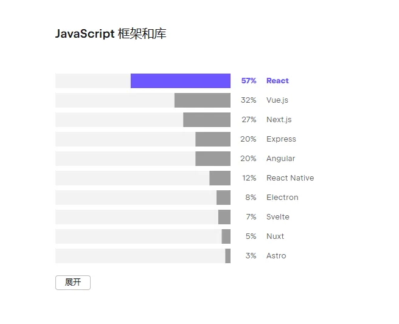
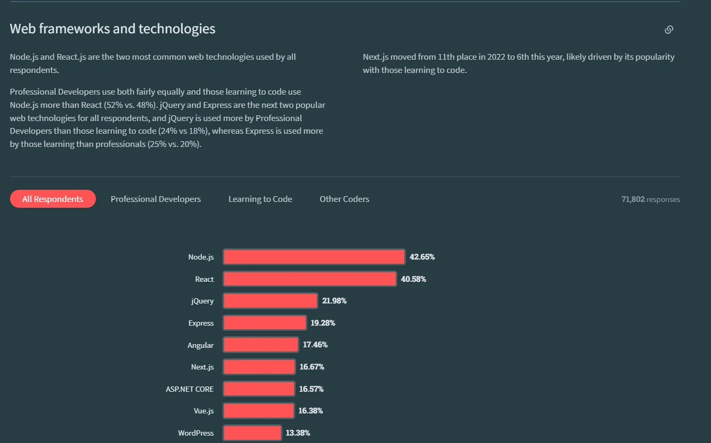
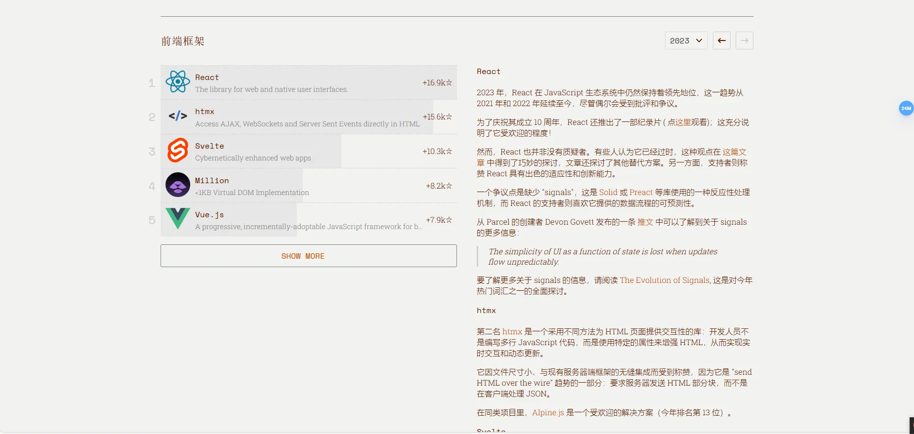
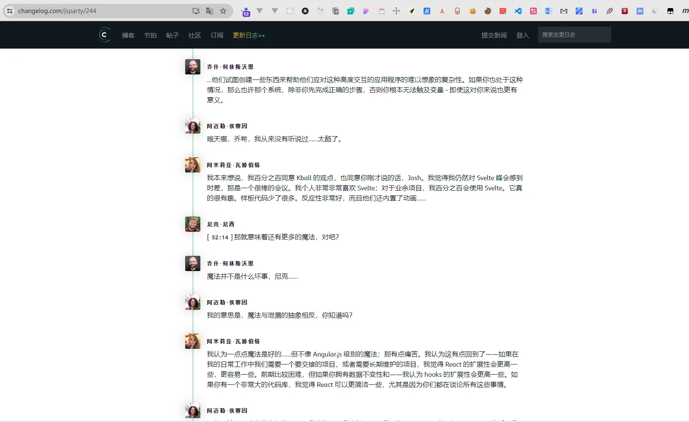

# {{ $frontmatter.title }}

>  :black_nib: 文章摘要

<!-- DESC SEP -->

这篇文章探讨了 Vue、React 和 Next.js 之间的选择，并深入分析了 React 的一些优缺点。作者指出，虽然 Vue 在国内市场占据主导地位，React 在国外仍然保持强大的活力。但与此同时，React 面临不少批评，特别是其逐渐显现的技术债务和性能问题。文章引用了一些反对 React 的观点，强调 React 已显老化，且与其他框架相比，存在着难以兼容和过度依赖自定义模块的问题。同时，文章还提到其他框架如 Svelte 的优越性，认为它能提供类似 React 的功能，但更加简洁和高效。

如果你对前端框架的选择和 React 未来的方向感兴趣，这篇文章将为你提供一些新的视角，帮助你做出更明智的决策。

<!-- DESC SEP -->

### Vue和React、Nextjs如何选择

--------

`Vue` 在大前端时代，在国内市场可谓是大杀特杀，几乎以压倒性的优势占领着国内市场，并且随着 2020 年`Vue3`的发布，以及`Vite`的推出，其生态更加完善，基本是国内市场做前端的首选语言。

但和国内相悖的是，在`JetBrains`与`StackOverflow`在2023年的数据报告中，在前端方面数据，`Node`和`React`以压倒性优势领先其他语言

2023JavaScript趋势报告：

和国内不同的是，`React`在国外保持着惊人的活力

但也有很多反对`React`的声音，以及关于`React`辩论的文章，如：

[你因为 React 而忘记（或从来不知道）的事情 - Josh Collinsworth 博客](https://joshcollinsworth.com/blog/antiquated-react)

[React 的自我实现预言 - Josh Collinsworth 博客](https://joshcollinsworth.com/blog/self-fulfilling-prophecy-of-react)

[辛辣的 React 辩论秀 🌶️ （JS Party #244） (changelog.com)](https://changelog.com/jsparty/244)

如果各位有兴趣可以读原文，我这里为每篇文章简单的总结。

#### 第一篇：[你因为 React 而忘记（或从来不知道）的事情 - Josh Collinsworth 博客](https://joshcollinsworth.com/blog/antiquated-react)

>
> 该文章也是被 `2023 JavaScript 行业调研报告` 所提到的文章，并且一些观点的确值得思考，但有的就一般了，为了准确传达原作者的意思，我这里会尽量中立的概括，也会引用部分原文进行对应部分内容的解释。

1. ##### 并不是所有好的事物都会流行。

   > 回首往事，我意识到：我天真地相信，任何好东西都不可避免地会流行起来——因此，任何值得了解的东西最终都会自己出现。

   
   >
   > 作者开篇就提到了好的事物并不会自然的流行，自然而然的出现到你面前，也就说明了另一个意思：**出现在你面前的，流行起来的可能并不是最好的选择**

2. ##### `React`已经老化了

   > React 从早期的框架游戏中受益匪浅;它设定了标准。但这在敏捷性和适应性方面存在严重缺陷。自 2013 年左右成立以来，React 做出的每一个决定都是另一层技术债务——它的新同时代人不受其约束。
   >
   > [再次引用亚历克斯的话](https://toot.cafe/@slightlyoff/110512849934452558)：
   >
   > > React 是 '13 技术，旨在 '08 约束。在 2023 年，它没有任何创新之处;事实上，这是现代获得函数式响应式前端编程的最慢方法......

3. ##### `React`是定制的，这使其在不同框架之间很难移植，几乎不和其他平台兼容

   > 使用 React，每当我们需要一个模块、一个小部件或一个库来做一些特定的事情（旋转木马、地图、手风琴或其他任何东西）时，*它必须是 React 的东西*;一个普通的 Web 东西或一个普通的 JavaScript 东西是行不通的。React 的所有规则以及对组件生命周期状态和怪癖的处理意味着任何*没有*明确为 React 编写的可用包或库都可能无法工作。
   >
   > **React 训练我们，需要*专门为某个框架*构建东西。但这已经不是真的了，可以说永远不应该是这样。**

   作者在这里举了个例子，通过框架之间的对比衬托`React`的独断专行

   > [Preact Signals](https://preactjs.com/guide/v10/signals/) 就是一个非凡的例子：虽然它是为使用 Preact 而构建的，但它可以在*任何*框架中导入和使用，甚至可以在普通的 JavaScript 中使用。Web 组件也与几乎任何现代非 React 框架兼容。

4. #####  React 钩子实际上有点过时了

   > 钩子是一种极好的模式，React 的普及值得称赞。但几乎所有其他框架都做得更好，规则更少，样板更少。

5. ##### `React`相对更加不智能

   > 如今，框架足够聪明，可以处理这种事情，而不需要你握住他们的手并解释他们应该做什么。

   "但React还是需要你做这些精细化管理"

6. ##### 服务器端渲染不再特别

   > 几年前，曾经有一段时间，当涉及到服务器渲染的内容（主要是通过Next JS）时，React几乎是唯一的选择。人们理所当然地对 React 可以在服务器上以 HTML 形式呈现的想法感到兴奋，而不是在客户端上作为单页应用程序 （SPA） 呈现。速度和SEO的收益是不容忽视的，最初，其他框架需要一点时间才能赶上。不过选择更多框架都做到了。

7. ##### React 是由 Facebook 创建的，目的是解决 Facebook 独特的一系列问题

   > 在 React 中使用表单是出了名的麻烦，因为每个用户击键都是一个两步过程：从输入中获取值;然后设置状态以匹配它（这反过来又不必要地重新渲染输入，以包含它已经完成的确切值，但与 React 状态同步）。当然，它通常太快而无法注意到，但这是很多额外的工作。
   >
   > 这就是为什么 React 的表单库激增的原因

8. #####  React 在性能上远远落后

   > 在许多情况下，React 在性能方面（这里我指的是捆绑包大小和执行速度）落后 2 倍或更多。（捆绑包本身可以是 10 倍或更多。最新一轮[的 JS Web 框架基准测试](https://github.com/krausest/js-framework-benchmark)显示，React 的性能平均比 Solid 慢近 50%，比 Vue 慢 25%，比 Svelte 慢 40%，比 Preact 慢 35%。（其他框架在此特定测试中不可用。

9. ##### Svelte 是没有废话的 React

   > Svelte 使用起来非常简单，相对容易学习（特别是如果你已经来自 React 世界，甚至语法通常也很相似），在几乎所有情况下都表现得更好，并且能够做任何 React 的事情，甚至更多

​	这也是作者留下的解决方案，并且根据作者本人所说，他本人的所有博客和网站都是有此完成.

#### 第二篇：[React 的自我实现预言 - Josh Collinsworth 博客](https://joshcollinsworth.com/blog/self-fulfilling-prophecy-of-react)

>
> 该篇文章是同一个作者在不同时期写的，本文完成时间更早，同样是对`React`的批评

1. ##### React 除了受欢迎之外，什么都不擅长。

   > 让我在 React 和根本没有前端框架之间做出选择，并且给定任何足够大小或复杂度的项目，我很乐意接受 React，非常感谢。
   >
   > React 为其他框架正在做和已经做的很多事情奠定了基础。[Vue 3](https://vuejs.org/guide/introduction.html) 及其组合 API 显然受到了 React hooks 的启发。[Svelte](https://svelte.dev/) 的许多约定都来自 React。[Nuxt](https://nuxtjs.org/) 是我使用过并喜欢的 Vue 框架，它的许多想法（以及 75% 的名称）都来自 [Next](https://nextjs.org/)，一个 React 元框架。就此而言，整个基于组件的前端设计和开发模型的当前状态（哈）很大程度上归功于 React——尽管应该指出的是，其他人也帮助铺平了道路。
   >
   > **React 做了它擅长的事情，但它并没有比其他*框架做得更好。***

2. ##### 更多的社区和支持并不代表他是一个更好的选择

   > 一个大的社区也可能是一个缺点，尤其是在所谓的“无主见”框架的情况下，比如 React。**这可能意味着有太多的套餐可供选择，以及太多不同的、相互竞争的意见，你必须在两者之间做出决定并采取立场。**

3. ##### 多年来，React 的满意度和兴趣一直在稳步下降，而其使用率却持平

   > React 很容易成为最常用的前端框架，也是知名度最高的前端框架，但在今年的 [JS 现状调查结果](https://2021.stateofjs.com/en-US/libraries/front-end-frameworks/)中，React 在满意度方面落后于 Solid 和 Svelte。React 在兴趣方面也排在 Svelte、Solid 和 Vue 之后（对于 React 来说，兴趣*低于 50%）*。
   >
   > React 在 [StackOverflow 调查](https://insights.stackoverflow.com/survey/2021#technology-most-popular-technologies)中远远落后于 Svelte，也仅略微领先于 Vue。

4. ##### 为什么 React 会保持领先地位呢？

   > “从来没有人因为选择 React 而被解雇”
   >
   > 这是安全的选择。它可能不是每个人的最爱，但不一定是。它可能也不会是任何人最不喜欢的。它会完成工作。

   像`Vue`一样，因为市场需要所以企业招聘，因为企业招聘，所以更多人学习，同样的，因为会的人多，所以企业招聘。他们完成了各自的闭环，但**这个选择可能不是最明智的，但绝对是最安全的。**

#### 第三篇：[辛辣的 React 辩论秀 🌶️ （JS Party #244） (changelog.com)](https://changelog.com/jsparty/244)

>
> 本篇文章主要是关于是否应该放弃`React`而投身其他框架，以及`React`自身存在问题的讨论
>
> 本篇文章是对一个讨论节目的翻译版本，会有很多观点，本文只总结，不站队

##### 观点一：React赢被放弃

> - React 或多或少是任何给定项目的默认选择。它已经达到了临界质量，感觉就像是一切的安全默认值.
>
> - 从性能到捆绑包大小，到入职，再到复杂性、开发体验......一般来说，所有这些事情都是 React 本身并不能真正获胜的领域，在这些领域有更好的选择
> - 当你缩小并查看大局时，你会意识到 React 在几乎每个给定的类别中都非常平庸，它真正擅长的唯一类别就是成为流行的东西。

##### 观点二：React有自己的难处，他不完美但已经做的很好了，并且也被很多人所接受

> - 当你流行时，你必须处理所有不同的情况。所以你不能只关注一件事而忽略其他。
> - 如果我只关心绝对性能，我会发布静态 HTML。
> - Stack Overflow 调查，我注意到 React 的满意度为 84%，高于 Vue，几乎是 Angular 的两倍，紧随 Svelte 之后，使用率更高。如果React被很多人使用，如果他不被大多数人满意，那他的满意度将会低很多，但事实上这并没有

##### 观点三：React更像一个仁慈的君主

> - 拥有一个几乎可以在任何地方使用的框架不是很好吗？我想要一个带有线条的 3D 旋转地球仪的库。你知道吗？你只需谷歌一下，它就在那里。你把它拉进来。很简单。生活很美好。（作为 2015 年框架战争的老兵，我只想说我们不想回到那个时代。每周都要面对一个新的框架，这让人筋疲力尽。）
> - 如果我们要有一个统治框架，难道我们不希望它没有主见吗？所以 React 真的很好，因为它基本上只是一个带有最小状态管理解决方案的渲染库。有许多其他东西建立在 React 之上，这使得它与其他框架相当。所以即使你考虑元框架，也有很多流行的框架。
> - 如果你了解 JavaScript，你几乎了解 React 的所有内容。他不会像Angular那样有很多新的“魔法”（这里指的是Angular引入的新的改变增加了学习成本，如管道，过滤器等）

##### 观点四：从公司架构思考问题

> React 的优势和我们遇到的摩擦都与它仍然由 Facebook 构建的事实有关，而 Facebook 的重点和优化选择都是为了解决 Facebook 所面临的问题。这些问题与许多公司在构建 JavaScript 应用程序时遇到的问题相当吻合，但一方面它们肯定是错的。
>
> 实际上，我认为你会在 Angular 中遇到一些相同的问题。Angular 仍然主要由 Google 想要什么和 Google 需要什么驱动。所以我认为，如果 Angular 达到这个水平——那么，早期的 Angular 确实很受欢迎，然后经历了很多这样的事情。
>
> 现在，如果你看看满意度，你会发现人们对 Angular 非常不满意，尽管有很多人在使用它。React 也可能会走这个老路……
>
> Vue 目前感觉更像是社区驱动。我觉得 Svelte 也在朝这个方向发展，尽管它们都是从仁慈独裁者的方式开始的。它们都拥抱了更广泛的社区，而不是只满足一家公司的需求

这几篇是一些影响力比较大的文章，相对来说观点已经比较全面了，大致分为以下几点：

1. React 因为时代原因已经有些过时了，因为使用的人很多，所以他每一次新功能的增加都将非常谨慎像现在的Java一样，虽然版本号一路突飞猛进，但是变化依然不大
2. React 的除了流行外别无优点，整体的性能，包大小，等都不够拔

但React也有其自己的优点：

1. 最强大的社区支持，你几乎能找到你想要的所有库
2. React不是一个框架，而是一个库，你多了解 JavaScript 就有多了解 React。他可以让你进行最大限度的定制

> 本文参考的文章如下：
> [JetBrains2023行业状况调研](https://www.jetbrains.com/zh-cn/)
>
> [StackOverflow2023行业调查问卷](https://survey.stackoverflow.co/2023/)
>
> [你因为 React 而忘记（或从来不知道）的事情 - Josh Collinsworth 博客](https://joshcollinsworth.com/blog/antiquated-react)
>
> [React 的自我实现预言 - Josh Collinsworth 博客](https://joshcollinsworth.com/blog/self-fulfilling-prophecy-of-react)
>
> [辛辣的 React 辩论秀 🌶️ （JS Party #244） (changelog.com)](https://changelog.com/jsparty/244)
