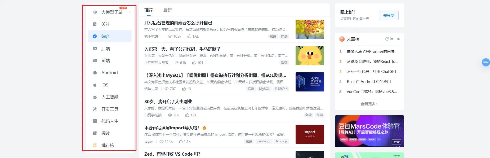

# {{ $frontmatter.title }}

对于大部分信息展示网站中都是通过大块的区域内容展示来展现更多信息，并且国内的对应的网站相对较老，所以UI设计以及UI风格上更加的质朴

如：
![[../../../public/posts/2024/08/10002/image-20240709144917869.webp]]

根据几个常见的网址论坛可以看出，对于信息的展示主要通过以下几种方式：

## **标签（板块）**

大多数论坛网站中在主页显眼位置，主要方便用户快速进入不同的模块或专题，将网站的主要内容和业务展示到用户最先注意到的范围内。

## 轮播图

相对于在通过标签直接进行展示，轮播图的使用在整体调研的网站中占比较低，并且多为较为老旧的UI，并且现在的大环境下用户只想了解希望得到的信息，找到目标信息后，点击查看，得到想要的信息，离开网站。

所以相对来说目前轮播图所能传递给用户的信息相对比较有限，可以不用于主要信息的展示

## 排行（热门）

最新、最近回复、热门、精选、排行

这三个功能几乎是目前所有主流的信息展示平台都会具有的功能，通过用户`只希望获取有用信息`的信息，通过各种各样的排行来诱导用户点击、评论、停留

所以可以在模块中增加该功能

## 实时新闻（信息）

在大多数网站中该内容反而并不常见，可能对于论坛平台，更多的是需要有效的信息，而不是新的信息

## 推荐文章流

这几乎是所有论坛中一定会有，而且是必须要有的功能，如果要列出来的话，目前所调研的网站都有该功能，主要区别在于不同的网站对于信息展示的理解

主要分为以下几种展示方式：

### 列表形式

### 列表形式（展示更多信息）

--------

### 问答形式

### 卡片形式

### 预览形式

综合已经搜索到的信息来看，信息的展示通过内容的不同，也有不同的展示方式，大部分使用的是列表形式，并且尽量展示少的正文，而是主要展示标题（可能这种方式可以增加点击率吧）

而对于文章，主要以传递信息为主，尽可能需要用户直接可以看到一个内容的主要或大致内容，增加阅读效率，所以大多采用`预览形式`

如果对于一些问题的来说，更多的是采用问答的形式，比如比较著名的`StackOverflow`
，根据用户的回答，其他用户可以对每个回答进行评分，当新用户看到该内容是，可以更加直观了解到有多少种解决方式，并找到最推荐的解决方式。

对于不同的信息展示形式，我认为都可以采用，对于不同的模块采用不同的展示形式，不同的展示形式在不同的信息时可以体现出不同的优势

## 这些网站所使用的技术

无论是对于这些论坛网站还是那些炫酷的网站，主要使用的语言包括

| 所使用的技术                        | 使用的网站数量 |      |
|-------------------------------|---------|------|
| Vue                           | 10      |      |
| Nuxt                          | 19      |      |
| React                         | 8       |      |
| Nextjs                        | 6       |      |
| 其他（Jquery，Threejs，WordPress等） | 29      |      |

* 如果同时使用两种技术如：Nuxt和Vue，则认为是Nuxt，不重复统计

目前来看`Nuxt`在一种开发语言中也占有一席之地，并且效果也很不错，但是在比较新的网站中如：`OpenAi`等使用Ntxtjs较多。

## 总结

针对目前的调研来看，信息的展示形式，主页面和信息页面的展示是相对比较主要的内容，对于他们的排版都可以借鉴

但我们目标并不是为了一个单一的用户服务，而是保罗万象，我们无法考虑到所有的模块，所以考虑像`豆瓣小组`
那种，让用户来创建对应的板块，根据板块的不同来对每个板块进行单独的优化。

现在无论是大站还是小站，只有一个样式或风格，无论是教程、博客、求助等等帖子都以同一种形式渲染；游戏模块、博客模块、教程模块等同样采用单一的排版布局，同一套样式布局。

我们可以解决这个问题，针对不同的板块提供不同的模板：

- 比如游戏模块可以提供背景图、轮播切换、所有元素替换为该游戏的风格；

- 对于博客模块可以对文章的渲染进行单独的优化，比如更加统一的排版、提供阅读清屏功能、屏蔽所有图片等功能；
- 对于摸鱼模块，提供每日新闻展示、热门主题展示等功能

**板块**和**板块**之间有用独立的配置和渲染效果，但是对于主页面，则采用更加简单更加现代化的布局展示，只有当进入不同的模块时才会有不同的渲染效果。

> 就像是一个商场，有的是服装店，那么他就有他独有的海报；对于酒馆，那就可以给他加更加应景的彩虹氛围灯；对于饭店，可以提供更大的位置，让他可以容纳更多食客

并且提供不同的模板后，在后期的维护中只需通过模板的改变就可以调整整体的功能或布局，而不用直接修改代码。但是相对的这会带来非常多的开发量。

## 参考的网站列表：

- https://edifis.ca/en/
- https://discoverybuildersllc.com/
- https://dgrees.studio/
- https://codeam.nl/
- https://lefruitstudio.fr/en/
- https://sandclock.madebyburo.com/
- https://euphemia.com/
- https://hotelodisej.com/
- https://www.teamgeek.io/
- https://nicolasloureiro.com/
- https://kentatoshikura.com/
- https://yoshikiokamura.art/
- https://kacper.ch/
- https://2022.ccncn.eu/
- https://www.wedesigndemand.com/
- https://plantica.net/
- https://www.dashq.io/
- https://www.artsphere.fr/
- https://the-haircut.webflow.io/
- https://hub.crunchdao.com/auth/register
- https://www.heights.agency/
- https://www.kirschberg.co.nz/work
- https://deidredriscoll.com/
- https://andpost.jp/
- https://aoba-kaikei.net/
- https://orf.sfc.keio.ac.jp/2019/
- https://www.sj33.cn/digital/wysj/202003/52607.html
- https://wickret.cuberto.com/
- https://www.hellomonday.com/
- https://www.wecargo.be/
- https://www.nikolastype.com/
- https://dennisberti.com/
- https://boy-coy.com/#contact
- https://int.pez.com/Geschichte/
- https://www.discourse.org/#
- https://www.resetera.com/
- https://dribbble.com/
- https://www.discourse.org/customers
- https://heydaystudio.fr/
- https://tilda.cc/cn/
- https://moreair.co/
- https://coolors.co/palettes/popular/bold
- https://joshcollinsworth.com/
- [Andrew McCarthy - Creative Developer & Designer, San Diego ✍](https://andrevv.com/)
- [Kyle Thacker — 设计师](http://kylethacker.com/)
- [Jim Ramsden - Designer of Internets](https://jimramsden.com/)
- [Shannon Lim](https://www.thisisveryrude.com/)
- [Advanced career for pilots on a Global Scale](https://www.pilot-republic.space/)
- [Ang Studio®](https://ang-studio.com/)
- [DES® | Design Education Series® by Obys®](https://des.obys.agency/)
- [PILOTE PARIS](https://piloteparis.com/)
- [Outsiders Fund](https://www.outsidersfund.com/)
- [Digital Design Days - Milan - 6-8 October 2024](https://ddd.live/)
- [Luis Bizarro - Creative Technologist](https://bizar.ro/)
- [Accueil - Storm Prod](https://www.stormprod.fr/)
- [Spaace | NFT Marketplace](https://spaace.io/)
- [Daylight | A More Caring Computer](https://daylightcomputer.com/)
- [Heyday Studio — Creative Studio, Branding & Places, Toulouse](https://heydaystudio.fr/)
- [Eva Sánchez - Interactive Designer](https://evasanchez.info/)
- [Flow/Digital Production House](https://www.justgowiththeflow.com/)
- [Oscar Pico — Digital Designer](https://www.oscarpico.es/project-page/viadomo-deco)
- [Augen — Pro Human](https://augen.pro/)
- [SPARKK | Web Agency and Website Creation in Nantes](https://sparkk.fr/en)
- [诺基亚 3310 eng](https://legendary3310.tilda.ws/en)
- [Ronin161 - D I G I T A L . G A N G](https://www.ronin161.com/)
- [TRIONN | Crafting Award-Winning Digital Journeys.](https://trionn.com/)
- [Pon The Store](https://pontheonlinestore.com/)
- [创建无偿的网站. 介绍TILDA PUBLISHING网站建设者](https://tilda.cc/cn/)
- [检查您自己的IP地址和DNS地址](https://whoer.net/zh)
- [PC游戏下载|PC破解游戏资源下载](https://www.gamer520.com/pcgame)
- [RequestBin — Collect, inspect and debug HTTP requests and webhooks](http://requestbin.cn/)
- [JavaScript Open Source Awards - GitNation](https://osawards.com/javascript/2023)
- [我告诉你](https://next.itellyou.cn/Original/Index?id=7ab5f0cb-7607-4bbe-9e88-50716dc43de6#)

