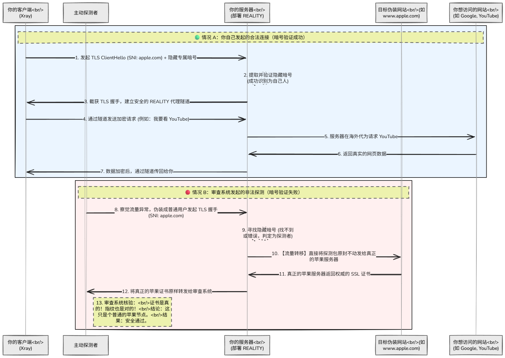
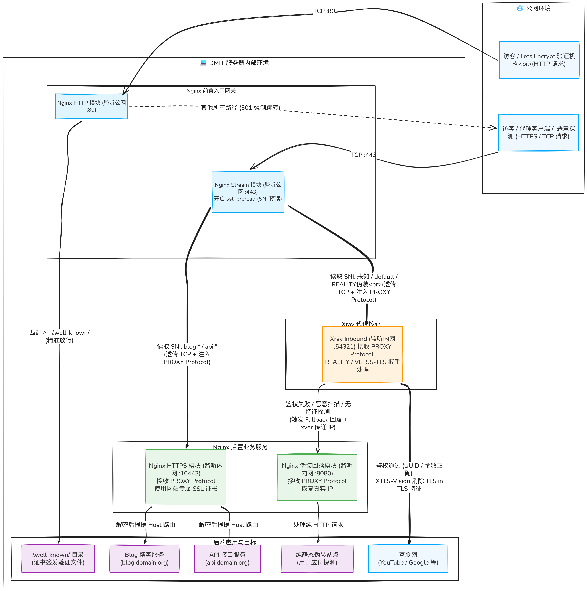
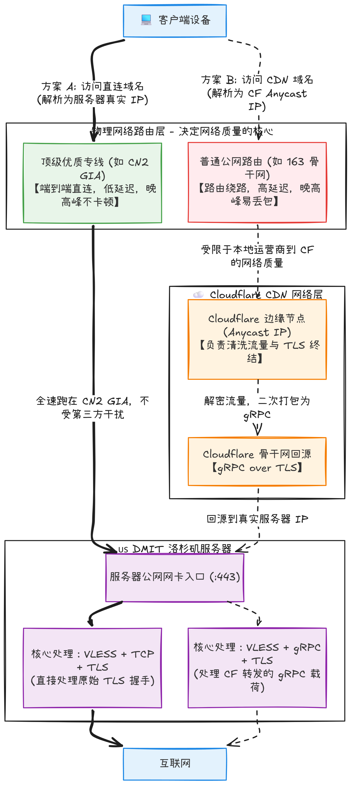

# Time Out to Reachable —— 安全网关搭建指北

>  此文章只罗列和科普原理，不涉及具体搭建教程

## REALITY —— 偷一个域名

### 何为 REALITY

REALITY 是 Xray-core 推出的一种革命性的 TLS 伪装技术。在配置私有网络隧道和代理服务时，它解决了一个长久以来的痛点：**不再需要自己购买域名、配置 DNS 解析、申请 SSL 证书，也不需要在服务器上搭建真实的 Web 服务作为伪装。**

### REALITY 解决的问题

传统”TLS 外套”类代理（Trojan、WS+TLS、TLS in TLS）存在两类常见风险：

- **被动识别**：DPI 通过看 TLS 握手里的 SNI、指纹（ClientHello/JA3/JA4）、统计特征来分类。
- **主动探测**：防火墙会主动连你的 IP:Port，用各种握手探针去“戳”你是不是违规；如果服务端返回“像代理”的特征响应，就会被拉黑。

REALITY 的定位是：**替代传统 TLS 作为 Xray 的安全层**，让连接在外观上更像“访问某个真实网站”的 TLS，同时让“主动探测者”拿不到确定证据。

### REALITY 原理

REALITY 完全抛弃了自己维护域名的路线。它允许你直接“借用”别人的高信誉域名（例如 `www.microsoft.com`、`www.apple.com`）来做伪装。

它的工作流程分为两种情况：

#### 情况 A：你自己的客户端发起连接（合法流量）

1. **客户端发起握手：** 你的本地客户端利用 uTLS 技术，伪装成普通的 Chrome 或 Edge 浏览器，向你的 VPS 发起 TLS Client Hello 握手请求。在这个请求中，SNI（服务器名称指示）写的是你指定的别人家的大型网站，比如 `sni: www.apple.com`。
2. **验证暗号：** 表面上这是普通的握手，但客户端的请求中隐藏了只有你的服务器才知道的身份验证信息（基于 x25519 密钥交换生成）。
3. **服务器放行：** 你的 VPS 收到请求后，会提取特征并进行解密。因为暗号正确，VPS 知道这是自己人，于是直接接管连接，建立安全的隧道并开始处理你的网络请求。

#### 情况 B：防火墙发起主动探测（非法流量）

1. **探测者发起握手：** 防火墙察觉到你的 VPS IP 有异常流量，于是伪装成普通用户，向你的 VPS 发送探测包，试图看看这个 IP 到底在提供什么服务。由于它看到之前的流量 SNI 是 `www.apple.com`，它也会发送包含该 SNI 的请求。
2. **暗号匹配失败：** 探测者没有你的专属密钥，发出的请求中不包含正确的隐藏验证信息。
3. **REALITY 伪装（完美转发）：** 你的 VPS 发现暗号不对，立刻判定这是探测者。此时，**VPS 会在内网直接向真正的 `www.apple.com` 发起连接**，并将防火墙发来的探测流量原封不动地转发过去。
4. **完美的假象：** 真正的苹果服务器收到请求后，会返回真实的、由权威机构签发的顶级 SSL 证书。你的 VPS 再把这个真实证书转发给防火墙。
5. **防火墙被骗：** 防火墙拿到证书一查：证书是真的，签发机构是权威的，连向该服务器的特征也完全符合。防火墙就会认为：**“这个 IP 真的只是苹果公司的一个海外 CDN 节点”**，从而放弃封锁。

整体时序图如下所示：

### REALITY 协议优势

**架构极简**，运维成本很低。无需 Nginx 等反代接入

**抹除了 CT 记录（Certificate Transparency）的致命伤**，REALITY 不需要申请证书，直接实现了“零 CT 审计留痕”。

**消灭了 DNS 解析轨迹**，不需要进行任何 DNS 查询，也就不存在 DNS 污染和解析记录暴露的风险。

**白嫖了高信誉域名的“白名单”**

### REALITY 需要注意的问题

1. **服务一定要在 443 端口**，因为在 **443** 端口建立网络服务几乎是事实上的标准，在其他端口建立只会让流量特征变得更加可疑
2. 尽量（**必须**）使用 **TLS 1.3** 协议。TLS 1.2 在握手阶段，服务器向客户端发送数字证书时，是**明文传输**的，如果被旁听可以明确监听到是否进行了伪装。
3. **不要使用自己或小站域名**。域名太新、太冷门、访问量形态怪反而适得其反
4. **尽量不要代理其他业务**。因为只有一个 443 端口，当整个端口都交给 xray 使用后，如果还想进行其他子域名的代理会显的很诡异，比如偷了 apple.com 的域名，又代理自己的子域名，那么对外表现就是即表现出大厂特征，又表现出个人站点特征，这在理论上也是相悖的。虽然 xray 的回落机制可以做到这一点，但不建议这么做

## 传统方案

当我们使用自己的域名时，我们已经有了自己的域名，并且当我们需要代理更多自己的业务，如 frp、多域名反代或其他等，那么传统的方案可能更好，也就是 `VLESS + TCP + TLS`

### 模块介绍

- **VLESS (协议层)：** 负责身份验证和流量路由。客户端将你要访问的请求（比如 Google）打包，贴上你的专属 UUID（相当于通行证），然后交给下层。VLESS 本身是不加密的，它极其轻量，把安全工作完全托付给了 TLS。
- **TCP (传输层)：** 负责将数据包从你的电脑搬运到服务器。使用最基础、最原生的 TCP 协议，意味着没有 WebSocket (WS) 那种为了伪装成网页请求而强行添加的冗余 HTTP 请求头，传输效率更高，资源占用更低。
- **TLS (加密与伪装层)：** 它不仅负责把你的数据加密成乱码，防止中间人窃听，更重要的是，它向外展示了一个合法的网站身份。当防火墙看到这股流量时，只会觉得”这是一个用户正在通过标准的 TLS 1.3 协议，安全地访问一个有真实证书的网站”。

### 流量中转方案

#### 传统流量中转流程（不建议）

1. **统一入口：** 公网流量（无论是正常访客还是特殊访问）访问 `https://www.yourdomain.com`，统一到达 Nginx 监听的 443 端口。
2. **Nginx 解密：** Nginx 使用配置好的 SSL 证书，将 TLS 加密层剥开，看到内部真实的 HTTP 请求。
3. **按路径分发（核心逻辑）：**
   - **正常业务：** 如果请求的路径是 `/api`、`/blog` 或者是根目录 `/`，Nginx 会按照常规配置，把流量转发给你服务器上运行的其他业务（比如跑在 8080 端口的 Java 服务，或者直接返回静态页面）。
   - **特殊业务：** 如果请求的路径是你提前暗中约定好的”秘密通道”（比如 `/my-secret-tunnel`），并且带有 `Upgrade: websocket` 的请求头，Nginx 就会知道这是特殊流量，将这个流量转发给 Xray 处理。
4. **移交 Xray：** Nginx 将这个秘密路径的流量，通过反向代理，原封不动地转发给监听在本地内网端口（比如 `127.0.0.1:10000`）的 Xray。
5. **Xray 处理：** Xray 拿到流量，完成 VLESS 验证，再去请求目标数据，然后原路返回。

#### Nginx 前置 SNI 四层分流 + Xray 回落方案（推荐）

1. **统一入口与流量窥探 (Nginx 预读)**：所有的公网流量统一经过 443 端口进入 Nginx。当流量到达时，Nginx 启用 `stream` 模块的 `ssl_preread` 功能。此时，Nginx **不进行 TLS 解密**，而是仅从 TLS 握手的初始包中，提取出明文的 SNI（访问者请求的域名）。*(注：2025年发布的 RFC 9849 虽可协商加密 SNI，但目前尚未全面普及，明文 SNI 仍是当前路由的主流依据。)*
2. **基于 SNI 的四层路径转发**：Nginx 拿到 SNI 后，开始在 TCP 层级规划流量路径：
   - **常规服务转发**：如果 SNI 是常规建站域名（如 `blog.domain.com`），Nginx 会将流量转发给内部负责建站的 HTTPS 监听端口，随后解密并处理 `/api`、`/blog` 等七层路径请求。
   - **核心流量透传 (Secret Tunnel)**：如果我们分配了一个专属的代理域名（如 `secret.domain.com`），Nginx 一旦检测到该 SNI 流量，将不进行任何干预，直接将**原始的 TCP 流量**透传给内网的 Xray 核心服务（如 `127.0.0.1:54321`）。
3. **Xray 核心解密与鉴权**：当 Xray 接收到被透传过来的原始 TCP 流量后，会使用协定好的 TLS 方式开始真正的解密操作。解密完成后，Xray 将拿到访问真实服务所需的 UUID 等参数：
   - **特殊访问放行**：Xray 在这里判断请求是否合法。如果 UUID 及其他参数完全正确，则放行该请求并提供代理服务。
4. **防御机制与主动回落 (Fallback)**：如果这是一个正常的常规请求（例如没有携带任何特殊参数），或者携带的参数错误（例如遭遇恶意探测），Xray 会果断触发“回落”机制。它会将该请求退回到 Nginx 的特定端口（如 `127.0.0.1:8080`），将事先准备好的静态博客或其他基础服务展示给对方，以此来证明这是一个“正常”的网站，完美隐藏背后的核心功能。

### 注意事项与处理方案

#### 1. 前置路由与后置服务的角色解耦 (Nginx vs 后置 Nginx/Caddy)

在这个架构中，存在“两个”截然不同的 Web 服务角色，物理上它们可以是同一个 Nginx 软件的不同模块，也可以是 Nginx + Caddy 的组合：

- **前置四层路由 (Nginx Stream 模块监听 443 公网端口)：** 它的角色是一个“瞎子快递员”，只看包裹上的运单号（明文 SNI），绝对不拆包裹。它**不需要、也不能**配置任何 SSL 证书，不处理任何 HTTP 请求。
- **后置七层服务 (监听内网端口如 10443 的 Nginx HTTP 模块或 Caddy)：** 它的角色是“业务前台”。当负责建站的流量（如 `blog`、`api`）被前置透传过来时，由它负责拿着对应的 SSL 证书进行真正的 TLS 解密，并处理具体的页面展示、反向代理（如转发给 FRP 面板）等常规业务。

#### 2. 证书自动化申请的“80端口死锁”陷阱

由于 443 端口被前置的 Nginx Stream 强行接管以处理 TCP 流量，传统的通过 443 端口进行 TLS 证书验证的方式将会失效。同时，如果你的 80 端口设置了“无脑强制跳转 HTTPS (443)”，会导致 Let's Encrypt 等机构的 HTTP-01 验证请求被踢入 443 端口的死胡同。

- **处理方案：** 在负责监听 80 端口的配置中，必须采用**精准规则分流**。放行所有针对 `/.well-known/acme-challenge/` 路径的纯 HTTP 访问，直接在本地返回验证文件；仅对除此以外的正常访客流量执行 301 强制跳转 HTTPS。

#### 3. 访客真实 IP 丢失问题 (PROXY Protocol 传递)

流量经过 Nginx Stream 的四层转发后，内网的 Xray 和后置的建站 Web 服务看到的访客源 IP 都会变成 `127.0.0.1`。这会导致博客无法统计访客真实地域，日志失去审计价值，甚至可能误触后端服务的防 CC 攻击机制。

- **处理方案：** 必须在流量链条上启用代理协议。
  - **Nginx 转发侧：** 在 `stream` 模块的 `proxy_pass` 下方开启 `proxy_protocol on;`。
  - **Xray 接收侧：** 在入站规则中开启 `acceptProxyProtocol: true`，并在回落规则中配置 `xver: 1` 或 `xver: 2` 以继续向后传递 IP。
  - **后置 Web 侧：** 在监听端口处加上 `proxy_protocol` 标识，并使用 `set_real_ip_from 127.0.0.1;` 来恢复访客的真实 IP。

#### 4. TLS in TLS 特征审计与 XTLS-Vision 

- **问题说明：** 当我们通过代理访问一个原本就是 HTTPS 的网站时，流量会被加密两次：内层是目标网站的 TLS 加密，外层是代理协议的 TLS 加密。这种“套娃”式的双重加密（TLS in TLS）会产生独特的握手特征和数据包长度分布（例如典型的握手包大小异常）。现代防火墙可以通过这些统计学特征，轻易识别出这是一条代理隧道并进行干扰。
- **处理方案：** 得益于我们这套方案让 Xray 掌握了原始 TCP 并亲自处理外层 TLS 握手，我们可以启用 **XTLS-Vision** 技术。
  - 在 Xray 的 VLESS 入站配置中，将 `flow` 设置为 `xtls-rprx-vision`。
  - **工作原理：** 在完成外层 TLS 握手并验证 UUID 合法后，它会检测内层传输的是否为 TLS 1.2/1.3 流量。如果是，Vision 会停止外层的二次加密，直接将内层的 TLS 流量”拼接”传递出去。这样一来，TLS in TLS 的特征被彻底消除，在防火墙看来，这段流量与普通的单一 HTTPS 流量毫无二致。

整体拓扑图如下：

## gRPC + TLS + Cloudflare 方案

### 方案概述

这个方案依靠 Cloudflare 服务实现流量转发，通过 CDN 网络隐藏源站 IP，并利用 gRPC 协议进行数据传输。

### 工作流程

1. **统一入口与 CDN 流量接管 (Cloudflare 前置)**：客户端不再直接连接你的服务器 IP，而是将流量发送给 Cloudflare 全球分布的 Anycast 泛播节点。所有的公网流量统一经过 Cloudflare 的 443 端口进入。在这个阶段，**外层 TLS 加密由 Cloudflare 负责终结（解密）**，使用的是托管在 Cloudflare 上的公共域名证书。
2. **基于 HTTP/2 的七层路由与回源 (流量清洗与转发)**：Cloudflare 在解密外层 TLS 后，能够看到完整的 HTTP/2 报文和请求路径（Path）。此时，它开始在七层（应用层）规划流量路径：
   - **常规服务转发**：如果访问的是普通的网页路径（如 `/` 或 `/blog`），Cloudflare 会按照常规 CDN 逻辑处理，返回缓存或向源站请求网页内容。
   - **核心流量透传 (gRPC 隧道)**：当客户端发出的请求是特定的 gRPC POST 请求（例如路径为 `/TunService/Tun`，且 Header 包含 `content-type: application/grpc`），Cloudflare 会识别出这是一个合法的 gRPC API 调用。它会保持 HTTP/2 的多路复用特性，**重新使用 TLS 加密**（回源加密），将这段 gRPC 流量转发给你隐藏在背后的真实服务器 IP。
3. **源站 Xray 核心解密与鉴权 (回源接收)**：你的服务器（源站）上的 Xray 监听着 443 端口，接收来自 Cloudflare 转发过来的回源 TLS 流量。Xray 会使用事先配置好的本地证书进行二次解密。解密完成后，Xray 解析出 gRPC payload 中的 VLESS 协议数据，并提取出 UUID 等参数：
   - **特殊访问放行**：Xray 在这里判断 UUID 和 gRPC `serviceName` 是否合法。如果完全匹配，则放行该请求，提取出真实的目标网站地址，并代为发起访问。
4. **防御机制与流量隔离 (云端与本地双重阻断)**：如果这是一个不合法的请求：
   - **云端阻断**：普通的恶意域名扫描或 IP 探测，绝大多数会被 Cloudflare 的 WAF（Web 应用防火墙）直接拦截在海外边缘节点，根本到达不了你的服务器。
   - **本地忽略/回落**：如果探测流量穿透了 CF 到达源站，或者有人直接针对你的服务器真实 IP 发起扫描，由于他们无法提供正确的 gRPC 路径和 VLESS UUID，Xray 会直接断开连接或根据配置回落到伪装网站，保护核心服务不被发现。

### 方案优势

#### 1. IP 隐藏与源站保护（核心优势）

**完全隐藏源站 IP**：客户端只需要知道 Cloudflare 托管的域名（如 `proxy.yourdomain.com`），无需知道真实服务器 IP。所有流量都先到达 CF 的边缘节点，再由 CF 回源到你的服务器。即使有人想要探测或攻击，他们面对的是 Cloudflare 的全球分布式网络，而不是你的单台 VPS。

**天然抗 DDoS**：Cloudflare 提供企业级的 DDoS 防护能力。无论是 SYN Flood、UDP Flood 还是应用层攻击，绝大多数恶意流量会被 CF 的边缘节点直接过滤，根本到达不了源站。这对于个人 VPS 来说，相当于免费获得了价值数千美元的防护服务。

**域名扫描免疫**：传统方案中，如果有人通过 CT 日志、DNS 历史记录等手段发现了你的域名，可以直接解析出服务器 IP 并进行探测。而使用 Cloudflare 后，域名解析指向的是 CF 的 IP 段，攻击者无法通过域名反查到源站真实位置。

#### 2. 流量特征混淆与合法性伪装

**gRPC 协议的天然优势**：gRPC 是 Google 开发的现代 RPC 框架，基于 HTTP/2 协议，在企业级微服务架构中被广泛使用。当你的流量以 gRPC 形式传输时，在防火墙看来，这就是一个普通的 API 服务调用，与 Google、Netflix、Uber 等大厂的内部服务通信毫无二致。

**HTTP/2 多路复用特性**：gRPC 基于 HTTP/2，支持在单一 TCP 连接上并发传输多个请求。这意味着你的代理流量可以与正常的网页访问、API 调用混合在同一条连接中，流量模式更加自然，难以被统计学分析识别。

**CDN 流量掩护**：所有流量都经过 Cloudflare 的 CDN 网络，在外部观察者看来，这只是一个使用了 CF 加速的普通网站。由于全球有数百万网站使用 Cloudflare，你的流量完全淹没在海量的正常 CDN 流量中，不会引起任何特殊关注。

#### 3. 零证书管理成本

**Cloudflare 托管证书**：外层 TLS 证书由 Cloudflare 自动签发和续期，你无需关心证书过期问题。CF 使用的是权威 CA 签发的证书，浏览器和客户端完全信任。

**回源证书灵活性**：源站到 Cloudflare 的回源连接，可以使用 CF 提供的 Origin CA 证书（15 年有效期），也可以使用自签名证书。由于这段连接只在 CF 和你的服务器之间，不会被外部审计，配置极其简单。

#### 4. 全球加速与智能路由

**Anycast 网络**：Cloudflare 在全球拥有 300+ 个数据中心，使用 Anycast 技术。客户端会自动连接到地理位置最近的 CF 节点，大幅降低首包延迟。

**智能回源优化**：CF 会根据网络状况，选择最优的回源路径。即使你的服务器位于美国西海岸，亚洲用户也能先连接到亚洲的 CF 节点，再由 CF 的骨干网高速回源，避免了跨洋链路的丢包和延迟。

#### 5. 配置简单，维护成本低

**无需复杂的 Nginx 分流**：不需要配置 Nginx Stream 模块的 SNI 分流、PROXY Protocol 传递等复杂逻辑。Xray 直接监听 443 端口，接收 CF 的回源流量即可。

**统一的流量入口**：所有业务（网站、API、代理）都可以通过同一个域名和端口提供服务，由 Cloudflare 根据路径进行智能分发。配置清晰，易于管理。

### 注意事项

#### 优质直连线路 (如 CN2 GIA) 的路由失效与资源浪费

- **问题说明：** 引入 Cloudflare 作为前置代理的核心代价，是彻底丧失服务器原有的优质物理链路（如电信 CN2 GIA、移动 CMIN2 等针对亚洲优化的专线）优势。流量路径从”客户端专属高速直连”变成了”客户端先连接 Cloudflare 就近泛播节点，再由 CF 骨干网回源”。国内连接免费版 CF 节点通常走拥堵的普通公网，受限于”木桶效应”，原本极优的网络体验在晚高峰时会被 CF 的入站线路瓶颈所严重拖累。

### 方案对比

## 三种方案综合对比

| 对比维度 | REALITY | 传统方案 (VLESS+TLS) | gRPC+Cloudflare |
|---------|---------|---------------------|-----------------|
| **部署难度** | ⭐⭐ 简单 | ⭐⭐⭐⭐ 复杂 | ⭐⭐⭐ 中等 |
| **是否需要域名** | ❌ 不需要 | ✅ 必须 | ✅ 必须 |
| **是否需要证书** | ❌ 不需要 | ✅ 需要申请和续期 | ⚠️ CF 自动管理 |
| **源站 IP 暴露风险** | ⚠️ 直接暴露 | ⚠️ 直接暴露 | ✅ 完全隐藏 |
| **抗主动探测能力** | ⭐⭐⭐⭐⭐ 极强 | ⭐⭐⭐⭐ 强 | ⭐⭐⭐⭐⭐ 极强 |
| **抗 DDoS 能力** | ⭐⭐ 弱 | ⭐⭐ 弱 | ⭐⭐⭐⭐⭐ 极强 |
| **流量特征** | 伪装成访问大厂网站 | 无需伪装，真实小站 | 伪装成 API 调用 |
| **CT 日志风险** | ✅ 无记录 | ⚠️ 有记录 | ⚠️ 有记录（CF 托管） |
| **DNS 解析风险** | ✅ 无需解析 | ⚠️ 需要解析 | ⚠️ 需要解析 |
| **网络性能** | ⭐⭐⭐⭐⭐ 直连最优 | ⭐⭐⭐⭐⭐ 直连最优 | ⭐⭐⭐ 受 CF 节点影响 |
| **延迟表现** | 最低（直连） | 最低（直连） | 较高（多一跳 CDN） |
| **适合 CN2 GIA 等优质线路** | ✅ 完美发挥 | ✅ 完美发挥 | ❌ 优势浪费 |
| **多业务共存** | ❌ 不建议 | ✅ 支持良好 | ✅ 支持良好 |
| **配置复杂度** | 简单（仅 Xray） | 复杂（Nginx+Xray） | 中等（Xray+CF 配置） |
| **维护成本** | 低 | 高（证书续期、Nginx 配置） | 低（CF 自动化） |
| **被封后恢复** | 换 IP | 换 IP | 换域名（IP 无影响） |
| **适用场景** | 个人轻量使用 | 多业务整合 | 高安全需求 |

